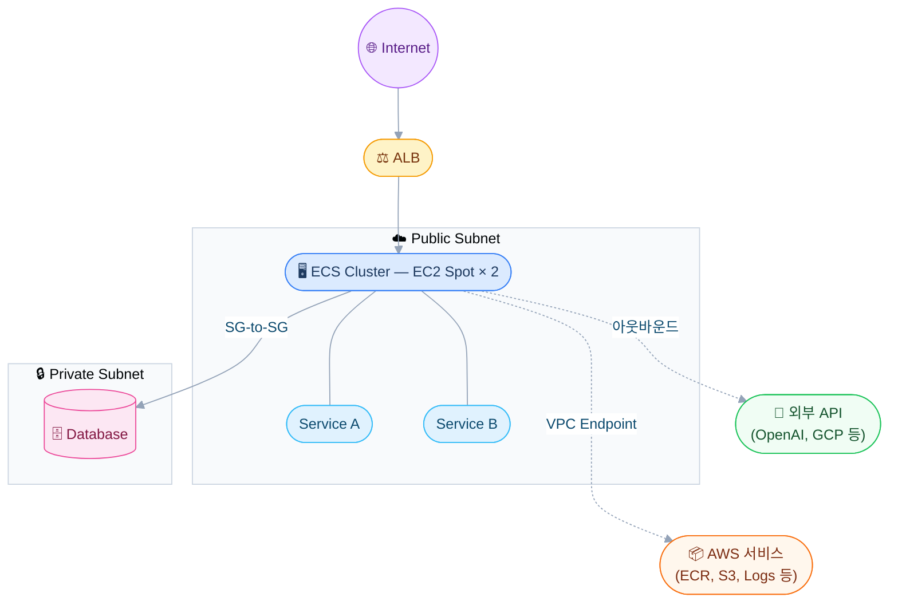

## 배경

HVAC(냉난방 설비) 도메인의 AI 챗봇 프로젝트를 진행하면서 인프라를 구성했다. 초기 구축 시 개발사 측에서 ECS Fargate 기반을 제안했고 그대로 진행했다. 아직 정식 운영 전이라 고객사가 아닌 개발사 측에서 인프라 비용을 부담하고 있었는데 AI 모델 비용을 제외하고도 운영+개발 환경 합산 비용이 꽤 나왔다. 정식 오픈 전 단계에서 이 비용은 부담스러웠고 비용 절감 요청이 들어왔다.

비용 구조를 뜯어보니 크게 네 가지가 눈에 들어왔다.

- **AWS Client VPN** — Private Subnet의 DB에 접속하기 위해 사용하고 있었는데 이게 비용에서 가장 큰 비중을 차지했다
- **NAT Gateway** — 운영/개발 각각 하나씩 두고 있었는데 AWS 서비스 접근 트래픽이 대부분이었다
- **Fargate 과금** — 서비스 5개가 각각 독립 Task로 돌아가면서 Fargate 비용이 누적되고 있었다
- **과잉 스펙** — 실제 리소스 사용량 대비 여유가 너무 많았다

하나씩 정리한 과정을 남긴다.

---

## 1단계: AWS Client VPN → OpenVPN 전환

비용에서 가장 큰 비중을 차지한 건 의외로 AWS Client VPN이었다. Private Subnet에 있는 데이터베이스에 접속하기 위해 사용하고 있었는데 연결 수와 시간에 따라 과금이 누적되면서 단일 항목으로 가장 비쌌다.

대안으로 **OpenVPN Access Server AMI**를 EC2에 설치하는 방식으로 전환했다. 소규모 접속 인원(개발자 몇 명)이면 무료 라이선스로 충분하고 EC2 인스턴스 비용만 발생한다. t3.micro나 t3.small 정도면 VPN 서버로 문제없이 동작한다.

기능적으로 달라지는 건 없다. Private Subnet의 DB에 접속하는 용도는 동일하고 OpenVPN 클라이언트로 연결하면 된다.

---

## 2단계: NAT Gateway 제거

다음으로 손댄 건 NAT Gateway였다. Private Subnet의 ECS Task가 ECR 이미지 Pull이나 CloudWatch 로그 전송뿐 아니라 OpenAI API, Google Maps API 같은 외부 서비스도 호출하고 있었다. AWS 서비스 간 통신은 VPC Endpoint로 대체할 수 있지만 외부 API 호출은 해결이 안 된다. NAT를 유지하거나 다른 방법을 찾아야 했다.

결론적으로 **ECS 서비스를 전부 Public Subnet으로 옮기고 NAT를 제거**했다. Private Subnet에는 데이터베이스만 남겼다.

### Public Subnet 배치가 가능한 이유

"Public Subnet = 위험하다"는 인식이 있지만 실제로는 보안 설정에 달려 있다.

- **Security Group inbound 0 rule** — 들어오는 트래픽이 없으면 공격 벡터 자체가 없다
- **Public IP 미할당** — EIP를 붙이지 않으면 외부에서 직접 접근이 불가능하다
- **ALB 뒤 배치** — 외부 노출 없이 ALB를 통해서만 트래픽을 받는다

Public Subnet에 있으면 NAT 없이도 아웃바운드 통신이 가능하다. AWS 서비스 접근은 VPC Endpoint로 처리하고 외부 API 호출은 Public Subnet의 인터넷 경로를 그대로 쓰면 된다. NAT 비용이 완전히 사라지고 네트워크 구조도 단순해졌다.

### VPC Endpoint 목록

Public Subnet이라도 AWS 서비스 접근은 VPC Endpoint를 쓰는 게 낫다. 인터넷을 경유하지 않으므로 속도와 비용 면에서 유리하다.

| 기능 | Endpoint |
|---|---|
| ECS 이미지 Pull | `ecr.api` / `ecr.dkr` |
| CloudWatch Logs | `logs` |
| S3 접근 | `s3` (Gateway — 무료) |
| Parameter Store | `ssm` / `ssm-messages` |
| Secrets Manager | `secretsmanager` |
| IAM 토큰 발급 | `sts` |

---

## 3단계: Fargate → EC2 Spot 전환

NAT를 제거한 후에도 Fargate 자체의 과금이 여전히 컸다. 같은 스펙을 EC2 Spot Instance로 돌리면 Fargate 대비 50\~70% 저렴해진다.

### 왜 Spot이 가능했나

Spot은 AWS가 언제든 회수할 수 있다는 리스크가 있다. 하지만 이 서비스는 다음 조건을 충족했다.

- **ECS가 Task를 자동 재배치**한다. Spot이 회수되면 다른 인스턴스에 Task가 올라간다
- **다중 AZ 구성**으로 한쪽이 회수되어도 다른 쪽에서 서비스를 유지한다
- **Stateless 서비스**라 인스턴스가 바뀌어도 영향이 없다

불안하면 OnDemand 1대를 최소 유지하고 나머지를 Spot으로 채우는 혼합 구성도 가능하다.

### 인스턴스 스펙 선정

서비스별 실제 리소스 사용량을 측정한 뒤 t3.medium(2 vCPU / 4GB)으로 결정했다.

| 서비스 | CPU | Memory | 비고 |
|---|---|---|---|
| admin-service | 0.15 vCPU | 256MB | 트래픽 낮음 |
| chatbot-service | 0.5 vCPU | 512MB | 스트리밍 처리 |
| chatbot-agent | 0.5 vCPU | 512MB | AI 호출 중심 |
| front-end | 0.1 vCPU | 128MB | SSR 최소 |
| milvus-api | 0.3 vCPU | 512MB | 벡터 검색 |

운영 2대(다중 AZ) + 개발 1대면 전체 서비스를 여유롭게 수용할 수 있었다.

### 아키텍처

---

## 결과

각 단계를 거치면서 전체 인프라 비용이 크게 줄었다.

| 단계 | 효과 |
|---|---|
| Client VPN → OpenVPN | 가장 큰 단일 비용 항목 제거 |
| NAT Gateway 제거 | NAT 과금 제거. VPC Endpoint 비용은 미미 |
| Fargate → EC2 Spot + 스펙 조정 | 동일 스펙 기준 50\~70% 저렴 |

서비스 구성이나 성능에는 변화가 없었다. ECS 운영 방식도 동일하게 유지된다.

### 추가로 검토 중인 부분

- **front-end → CloudFront + S3 전환** — 현재 front-end가 ECS Task로 돌아가고 있는데 SSR이 필요 없는 정적 사이트라 CloudFront + S3로 전환하면 Task를 추가로 줄일 수 있다. 적용 예정이다.

---

## 주의할 점

- **Spot 회수 대비** — 다중 AZ + OnDemand 혼합 구성을 권장한다. 순수 Spot만으로 운영하면 동시 회수 시 다운타임이 발생할 수 있다
- **VPC Endpoint 누락** — 하나라도 빠지면 ECS Task가 이미지를 못 받거나 로그를 못 보낸다. 전환 전에 필요한 Endpoint를 전부 확인한다
- **Public Subnet 보안** — inbound 0 rule과 Public IP 미할당은 반드시 지켜야 한다. 하나라도 풀리면 보안 의미가 없어진다
- **DB는 Private에 유지** — 데이터베이스는 Public Subnet에 둘 이유가 없다. 외부 접근이 필요 없으므로 Private Subnet에 두고 SG-to-SG로 ECS에서만 접근하도록 한다