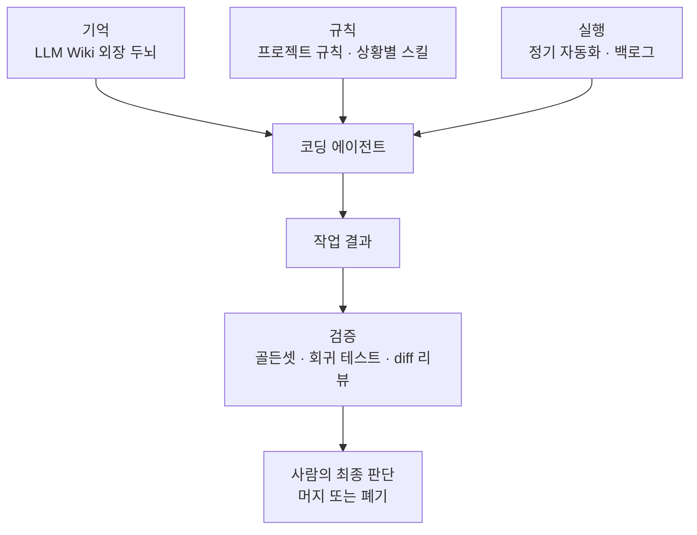
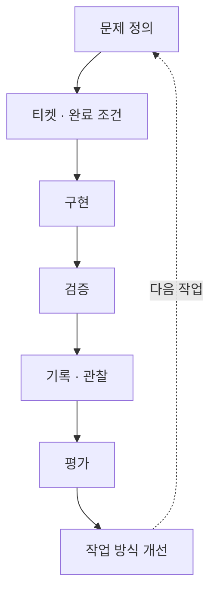

AX 인재전쟁 예선에서 상위 약 10%에 선정됐지만 본선 진출에는 실패했다. 이 일을 계기로 내가 코딩 에이전트와 일하는 방식을 한번 돌아보게 됐다.

_AX 인재전쟁 공식 이미지. 출처: [AX 인재전쟁 공식 페이지](https://hackathon.jocodingax.ai/)_

나는 평소에도 모델이나 프롬프트만큼 에이전트가 일하는 환경을 설계하는 일이 중요하다고 생각해왔다. 외장 두뇌를 만들고 자율 실행 루프와 회귀 테스트를 붙인 과정도 여러 글에 정리했다. 이번에 확인하고 싶었던 것은 이 방향이 맞는지가 아니라, 실제로 만든 장치들이 제 역할을 하고 있는지였다.

이를 확인하려고 사람들이 실제로 가져다 쓰는 코딩 에이전트 스킬과 공식 문서를 읽었다. 개별 기능을 따라 하기보다 그 안에 들어 있는 원칙을 살펴보고, 현재 일하는 방식과 비교했다. 어떤 실패를 막기 위한 규칙인지, 검증은 어느 단계에 두는지, 내 방식에는 무엇이 부족한지를 확인하고 싶었다.

여기서 내가 말하는 하네스는 모델 밖에서 에이전트의 작업을 둘러싼 장치다. 어떤 컨텍스트를 읽힐지 정하고, 어떤 도구와 규칙을 쓰게 하며, 실행 결과를 어떻게 확인할지 연결한다. 검증은 결과의 성공과 실패를 가르는 일이고, 관찰은 그 결과에 이르기까지 에이전트가 어디서 헤맸는지 남기는 일이다.

---

## 지금 내가 코딩 에이전트와 일하는 방식

우선 지금 사용하고 있는 방식을 정리해봤다. 내가 만든 장치는 기억, 실행, 검증, 규칙 네 가지로 나눌 수 있었다.

**기억.** 결정 이력과 API 계약을 [별도 레포에 쌓아 외장 두뇌로](/blog/llm-wiki-coding-agent-knowledge-base) 쓴다. 여러 레포에서 에이전트를 동시에 띄울 때 매 세션 같은 설명을 반복하지 않기 위한 장치다. 에이전트는 레포 전체를 뒤지는 대신 필요한 문서만 골라 읽고 시작한다.

**실행.** 그 위에 [정기 실행 루프를 얹어](/blog/harness-automation-with-hermes-agent) 백로그를 읽고 작업을 위임하고 결과를 보고하게 했다. 머지할지 말지는 내가 정한다. 실행까지는 맡기되 마지막 판단은 사람에게 남긴 구조다.

**검증.** [골든셋과 LLM judge로 회귀 테스트를](/blog/llm-agent-testing-golden-set) 만들었다. 규칙으로 확인할 수 있는 것은 코드로 확인하고, 판단이 필요한 것만 judge에 넘긴다. 커밋 전에는 다른 모델에게 diff 리뷰를 한 번 받는 규칙도 있다.

**규칙.** 프로젝트마다 규칙 파일에 컨벤션을 적어두고 상황별 스킬을 만들어 사용한다. 글쓰기용, 디버깅용, 리뷰용이 따로 있다.

이 목록만 보면 필요한 것은 어느 정도 갖춘 것처럼 보인다. 하지만 처음부터 원칙을 세우고 만든 체계는 아니다. 불편한 일이 생길 때마다 장치를 하나씩 붙여왔다. 덕분에 할 수 있는 일은 늘었지만 무엇이 정말 도움이 됐는지 판단할 기준은 함께 만들지 못했다.

---

## 여러 스킬과 자료에서 공통점을 찾았다

먼저 [awesome-harness-engineering](https://github.com/ai-boost/awesome-harness-engineering)에 모인 자료를 보면서 에이전트 하네스가 다루는 범위를 정리했다. 계획과 작업 분해, 컨텍스트와 메모리, 도구와 권한, 실행과 오케스트레이션, 검증과 CI, 관찰과 추적, 디버깅과 평가까지 범위가 넓었다. 내가 만든 외장 두뇌와 자동화, 회귀 테스트도 이 안에 포함됐지만 각각을 하나의 작업 흐름으로 놓고 살펴본 적은 없었다.

[mcp-eval](https://github.com/lastmile-ai/mcp-eval)처럼 MCP 서버의 동작을 평가하는 도구도 확인했고, Anthropic의 문서에서는 컨텍스트와 도구를 설계한 뒤 실제 사용 기록과 평가 태스크를 통해 개선하는 방법을 살펴봤다. 자료마다 다루는 대상은 달랐지만, 에이전트에게 일을 맡기는 데서 끝내지 않고 결과와 과정을 확인할 수 있어야 한다는 점은 같았다.

여러 자료 중에서는 [mattpocock/skills](https://github.com/mattpocock/skills)가 특히 관심이 갔다. `grilling`, `domain-modeling`, `codebase-design`, `to-tickets`, `debugging`, `tdd` 같은 스킬이 문제 정의부터 설계, 작업 분해, 구현과 검증까지 이어져 있었다. 각 스킬의 기능만 설명하는 것이 아니라 어떤 실패를 막으려는지와 그 바탕이 된 개발 원칙도 함께 적혀 있었다. 이후 내용은 이 스킬들을 중심으로 살펴보되, 컨텍스트와 도구 평가는 Anthropic 문서와 AGENTS.md 연구를 함께 참고했다.

---

## 일을 시작하기 전에 그림부터 맞춘다

합의 없이 시작하는 것, 같은 개념을 서로 다른 말로 설명하느라 대화가 길어지는 것, 결과를 확인할 방법이 없는 것, 코드 구조가 무너지는 것. 모두 에이전트가 생기기 전부터 개발팀이 겪던 문제다. 해결 방식도 실용주의 프로그래머와 DDD, XP를 비롯한 기존 소프트웨어 설계와 개발 방법론에서 가져온다. 에이전트가 새로운 문제를 만들었다기보다 원래 있던 문제가 더 빨리 드러난다고 보는 쪽이다.

작업의 시작에는 `grilling`이 있다. 여러 질문을 주고받으면서 코딩 전에 요구사항과 결정을 구체화하는 스킬이다.

지시문이 구체적이다. 얽혀 있는 결정들을 하나씩 풀어가되, 질문은 반드시 한 번에 하나씩 던지고 답을 기다린다. 여러 개를 한꺼번에 물으면 상대를 어리둥절하게 만든다고 적혀 있다.

사실과 결정을 가르는 규칙도 있다. 파일을 뒤져서 알 수 있는 사실이면 사람에게 묻지 말고 직접 찾는다. 결정은 사람 몫이니 하나씩 내밀고 기다린다. 그리고 서로 같은 그림을 그리고 있다고 사람이 확인하기 전에는 손대지 않는다.

그다음은 용어다. 팀이 같은 말을 쓰지 않으면 대화할 때마다 설명이 다시 필요해진다. 그래서 용어집을 두고 모듈이나 이음매 같은 단어를 정의한 뒤, 같은 대상을 컴포넌트나 서비스로 바꿔 부르지 말라고 못 박는다. 핵심은 같은 개념을 항상 같은 이름으로 부르는 것이다.

용어집을 읽다가 인터페이스의 범위를 꽤 넓게 잡는다는 걸 알았다. 타입 시그니처만이 아니라 지켜야 할 불변 조건, 호출 순서, 에러가 나는 방식, 필요한 설정, 성능 특성까지 포함한다. 호출하는 쪽에서 올바르게 쓰려면 알아야 할 내용을 모두 인터페이스로 본다.

결정은 ADR로 남기되 조건이 붙는다. 되돌리기 어렵고, 맥락 없이 보면 의아하며, 분명한 트레이드오프가 있을 때만 적는다. 모든 판단을 기록하는 것이 아니라 나중에 온 사람이 "왜 이렇게 했지"라고 물을 만한 결정만 남긴다.

---

## 에이전트와도 티켓으로 일한다

일감을 다루는 방식도 다시 살펴봤다. 논의가 정리되면 스펙 문서로 만들고, 스펙을 구현 티켓 여러 장으로 나눈다. 티켓은 파일 하나에 하나씩 번호를 붙여 관리한다. 여러 티켓을 하나의 파일에 모으지 않는다.

저장소의 이슈와 PR을 분류하는 triage 규칙에는 상태 라벨이 붙는다. 분류 전, 정보 부족, 에이전트에게 맡겨도 됨, 사람이 해야 함, 안 하기로 함. 다섯 가지다. 스펙에서 새로 만든 구현 티켓은 기본적으로 "에이전트에게 맡겨도 됨" 상태에서 시작한다.

내게 특히 필요해 보인 것은 "에이전트에게 맡겨도 됨"이라는 라벨이었다. 자리를 비운 사이 에이전트 혼자 처리해도 될 만큼 티켓이 구체적인지를 별도로 관리한다. 일을 맡겨도 되는 상태인지 감으로 넘기지 않고 라벨로 드러낸다.

구현 스킬은 티켓을 기준으로 테스트를 먼저 작성하고 리뷰까지 진행한다. 논의, 스펙, 티켓, 구현, 리뷰가 하나의 작업 흐름으로 연결돼 있다.

이 흐름 자체는 낯설지 않다. 일감을 잘게 나누고 상태를 확인하면서 작은 단위로 자주 진행한다. 팀에서 애자일 방식으로 일하며 해왔던 일이다. 티켓은 단순한 할 일 목록이 아니라 세션이 바뀌어도 에이전트가 작업 범위와 완료 조건을 다시 확인할 수 있는 기준이 된다.

---

## 구현하기 전에 검증 기준부터 만든다

확인할 방법이 없다는 문제에는 특히 강한 규칙이 붙어 있다. 디버깅 스킬의 첫 단계는 통과와 실패를 구분할 수 있는 검증 방법을 만드는 일이다. 원문에서도 이 단계를 디버깅의 핵심으로 두고, 이후 과정은 대부분 반복 작업으로 본다.

버그를 확실하게 재현할 수 있으면 범위를 좁히고 가설을 확인할 수 있다. 반대로 재현 방법이 없으면 코드를 오래 들여다봐도 문제가 해결됐는지 판단하기 어렵다. 그래서 검증 방법을 만드는 데에는 시간을 아끼지 말라고 한다.

여기서 말하는 검증은 테스트 커버리지 같은 넓은 숫자가 아니다. 특정 문제를 재현하고, 수정한 뒤 문제가 사라졌는지 확인할 수 있어야 한다. 가장 먼저 시도하는 것은 버그와 맞닿은 이음매에서 실패하는 테스트다. 그게 어렵다면 개발 서버에 요청을 보내는 HTTP 스크립트, 정해진 입력과 이전 출력을 비교하는 CLI 호출, 화면과 콘솔을 확인하는 헤드리스 브라우저 스크립트를 사용한다.

더 내려가면 실제 요청이나 이벤트 로그를 저장해뒀다가 해당 경로만 다시 돌리는 방법이 있다. 시스템의 최소 부분만 띄운 재현 장치를 만들거나, 가끔만 발생하는 버그에는 무작위 입력 1,000개를 넣어 실패 조건을 찾기도 한다.

사람이 직접 클릭해야 하는 상황은 마지막에 고려한다. 이때도 확인 절차를 스크립트로 작성해 같은 과정을 반복할 수 있게 한다. 자동화할 수 있고 빠르게 실행되는 검증부터 시도하고, 사람이 참여하는 방식은 가장 나중에 사용한다.

TDD 스킬에는 같은 원칙이 다른 각도로 있다. 테스트를 쓰기 전에 어느 이음매에서 확인할지 먼저 적고 사람과 합의한다. 합의 안 된 이음매에는 테스트를 쓰지 않는다. 전부를 테스트할 수는 없으니, 어디를 지킬지 먼저 정하는 것이 테스트에 들이는 노력을 핵심 경로에 앉히는 방법이라는 논리다.

하지 말라는 목록도 구체적이다. 테스트를 전부 쓴 다음 구현을 몰아서 하는 방식을 막는다. 그렇게 하면 상상한 동작을 검증하게 되고, 구현을 이해하기도 전에 테스트 구조에 묶인다. 대신 테스트 하나에 구현 하나씩 짝지어 나가고, 각 테스트는 직전에 배운 것을 반영해서 쓴다.

기대값을 코드와 같은 방식으로 다시 계산하는 테스트도 금지 목록에 있다. 그런 테스트는 만들어질 때부터 통과할 수밖에 없어서 코드와 다른 의견을 낼 수 없다. 기대값은 알려진 정답이나 손으로 푼 예제처럼 코드 바깥에서 와야 한다.

---

## 컨텍스트를 예산처럼 쓴다

Anthropic의 [컨텍스트 엔지니어링 문서](https://www.anthropic.com/engineering/effective-context-engineering-for-ai-agents)는 원하는 결과가 나올 확률을 높이는 가장 작은 컨텍스트를 찾으라고 한다. 모델이 좋아지더라도 컨텍스트를 아껴 써야 한다는 원칙은 남는다고 적는다.

처음부터 시스템 프롬프트에 규칙을 잔뜩 넣지도 않는다. 좋은 모델에 최소한의 프롬프트로 시작하고, 실제로 실패한 지점을 본 뒤 지침을 더한다. 아직 일어나지 않은 엣지 케이스를 상상해서 채우기보다 확인된 실패부터 보강한다.

예시에 대한 지적도 같은 결이다. 규칙을 전부 적으려고 엣지 케이스를 잔뜩 밀어 넣는 게 흔한 실수이고, 대신 기대하는 동작을 잘 보여주는 대표 예시 몇 개를 고르라고 한다. 모델에게 예시는 천 마디 말의 가치가 있는 그림이라는 표현이 붙어 있다.

도구 설계에는 실용적인 기준이 하나 있다. 어떤 상황에서 어느 도구를 써야 하는지 사람 엔지니어가 딱 잘라 말하지 못하면, 에이전트가 그보다 잘하기를 기대할 수 없다. 도구가 겹치거나 애매하면 모델 탓이 아니라 설계 탓이라는 것이다.

맥락은 미리 다 넣지 않는다. 파일 경로나 저장해둔 쿼리처럼 가벼운 이름표만 들고 있다가, 필요해질 때 도구로 불러온다. 사람이 모든 자료를 외우지 않고 필요할 때 찾아보는 것과 같은 구조다.

그래도 넘치면 요약해서 넘긴다. 설계 결정과 아직 안 풀린 문제는 남기고 중복된 출력은 버리는데, 요령은 처음엔 넉넉하게 남기고 시작해서 확인해 가며 점점 덜어내는 것이다. 이미 쓸모를 다한 도구 결과부터 지우는 것이 가장 값싼 방법으로 소개된다.

범위가 큰 탐색은 서브에이전트에 맡긴다. 서브에이전트는 수만 토큰을 사용해 자료를 확인하고, 메인 에이전트에는 1,000~2,000 토큰으로 정리한 내용만 전달한다. 탐색 과정에서 생긴 컨텍스트를 메인 에이전트가 모두 가지고 있지 않아도 된다.

내 외장 두뇌도 필요한 문서만 골라 읽히는 구조라서 방향은 비슷했다. 다만 왜 그래야 하는지를 원칙으로 정리해두지는 않았다. 문서를 많이 쌓는 것보다 어떤 문서를 언제 읽힐지 정하고, 실제로 도움이 됐는지 확인하는 일이 더 중요했다.

---

## 만든 도구는 평가한 뒤 개선한다

[도구를 만드는 방법에 대한 문서](https://www.anthropic.com/engineering/writing-tools-for-agents)에서 배운 건 만드는 법보다 고치는 법이다. 시제품을 빠르게 적용한 다음 평가 태스크로 결과를 확인하고, 에이전트와 함께 분석하면서 도구를 개선한다.

평가 태스크에는 기준이 있다. 실제 사용에 뿌리를 두고 많이 만들 것, 그리고 도구를 여러 번 불러야 풀리는 실제 업무를 닮을 것. 샌드박스에서 한 번 부르면 끝나는 질문은 태스크가 아니다.

평가할 항목도 정확도만이 아니다. 호출 한 번에 걸리는 시간, 태스크당 총 호출 횟수, 토큰 소비량, 에러 빈도를 같이 모은다. 세 번에 끝낼 일을 열세 번에 처리하는 에이전트는 정확도만 보면 차이가 없지만 비용과 시간에서는 차이가 드러난다.

기록을 읽는 법에 대한 문장이 하나 있다. 에이전트의 피드백에서 빠져 있는 것이 들어 있는 것보다 중요할 때가 많다. 도구가 불편하다는 설명 대신 해당 도구를 쓰지 않거나 다른 길로 돌아가는 모습으로 나타날 수 있다. 그걸 잡으려면 기록을 모아두고 읽는 수밖에 없다.

직접 확인하지 않으면 예상과 다른 결과가 나올 수 있다. [AGENTS.md의 효과를 분석한 2026년 연구](https://arxiv.org/abs/2602.11988)에서 LLM이 만든 컨텍스트 파일을 사용했을 때 두 평가 환경의 해결률은 평균 0.5%p와 2%p 낮았다. 이 차이는 통계적으로 유의하지 않았지만, 비용은 각각 20%와 23% 유의하게 늘었다. 개발자가 직접 작성한 파일은 LLM이 만든 파일보다 평균 7%p 높은 결과를 냈지만, 컨텍스트 파일이 없는 조건과 비교한 개선 폭은 평균 2.4%p였고 이 역시 통계적으로 유의하지 않았다.

그렇다고 모든 컨텍스트 파일이 쓸모없다는 결과는 아니다. 연구진도 기존 문서가 모두 제거된 환경에서는 LLM이 만든 컨텍스트 파일이 평균 2.7% 개선됐다고 덧붙였다. 파일이 있느냐보다 기존 문서와 겹치지 않는 지침을 담았는지, 실제 작업에서 효과가 있었는지를 따로 봐야 했다. 내 외장 두뇌의 상당수를 에이전트가 초안으로 작성하기 때문에 남의 이야기로 넘기기 어려웠다.

---

## 현재 방식을 다시 살펴보니 검증과 관찰이 부족했다

스킬과 공식 문서에서 확인한 원칙을 현재 작업 방식과 비교했다. 외장 두뇌와 실행 루프의 방향이 잘못된 것은 아니었다. 필요한 문서만 골라 읽히고, 실행은 맡기되 마지막 판단은 내가 한다. 부족한 부분은 작업을 시작하기 전과 결과가 나온 뒤에 있었다.

빠져 있던 부분은 여섯 가지였다.

**질문하는 단계를 건너뛴다.** 요구사항을 구체화하는 스킬을 설치해두고도 실제로는 바로 만들기 시작한다. 머릿속에 그림이 있으면 문제 정의도 끝났다고 여겼다. 그러다 보니 처음 생각한 범위를 넘어 여러 상황을 한꺼번에 다루려는 일이 자주 생겼다.

**혼자가 되면서 티켓이 사라졌다.** 원래는 티켓으로 일했다. 나는 애자일을 좋아하고, 회사에서 다른 사람들과 일할 때는 일감을 티켓으로 만들어 에이전트와도 그 내용을 기준으로 대화를 시작했다. 그런데 혼자 하는 프로젝트에서는 그 습관이 사라졌다. 티켓은 팀원과 공유하려고 쓰는 문서라고 생각했기 때문에, 보는 사람이 없어지자 만들 이유도 같이 없어졌다.

그런데 없어진 게 공유 문서만이 아니었다. 티켓에 적던 완료 조건과 작업 범위는 에이전트에게 주던 입력이기도 했다. 그게 빠지자 대화창에 큰 덩어리로 일을 시키는 방식으로 돌아갔고, 진행 상황은 대화에만 남아 세션이 닫히면 같이 사라진다. 이슈 트래커 규약을 세팅하다가 알게 됐다. 티켓의 독자는 사람만이 아니었다.

**검증 기준을 뒤늦게 만든다.** 골든셋은 기능을 다 만든 뒤에 붙였다. 통과 기준을 먼저 정한 상태에서 구현한 것이 아니라, 구현을 마친 뒤 검증을 추가했다. 이 순서에서는 검증 기준이 설계에 반영되기 어렵고, 구현이 끝난 뒤에도 무엇을 통과로 봐야 할지 애매해진다.

**만든 도구를 평가하지 않는다.** 스킬과 자동화를 여럿 만들었지만 평가 태스크로 비교해본 적이 없다. 몇 번 써보고 괜찮으면 그대로 뒀다. 호출 횟수와 토큰, 에러 빈도를 모르니 어느 스킬이 실제로 도움이 되는지 말할 근거도 없다. 도구는 만들었지만 평가 기준은 만들지 못했다.

**기록을 모으지 않는다.** 세션 로그와 도구 호출 기록을 남기는 장치가 없다. 잘 풀린 세션과 헤맨 세션이 뭐가 달랐는지 나중에 볼 방법이 없다. 빠져 있는 것을 읽으라는 조언은 기록이 있어야 쓸 수 있는 조언이다.

**에이전트가 쓴 컨텍스트를 검증하지 않는다.** 외장 두뇌의 문서 초안을 에이전트가 쓰는데, 그 문서가 다음 에이전트의 결과를 개선하는지 확인한 적이 없다. 앞서 본 연구처럼 효과는 기존 문서와 작업 환경에 따라 달라질 수 있다. 많이 쌓였다는 사실만으로 다음 작업에 도움이 된다고 가정할 수는 없다.

적고 나니 공통점이 보였다. 나는 구현 과정에 필요한 장치에는 꾸준히 투자했지만, 구현하기 전의 문제 정의와 구현한 뒤의 평가에는 충분히 투자하지 않았다. 기능과 문서는 계속 늘었지만 각각의 효과를 확인할 기록과 기준이 부족했다.

---

## 앞으로의 순서

어디서부터 개선할지도 순서가 필요했다. 기록이 없으면 이전 결과와 비교할 수 없고, 비교하지 않으면 나머지를 바꿔도 실제로 나아졌는지 알 수 없다. 그래서 기록부터 시작하기로 했다.

**1. 기록부터 남긴다.** 훅으로 세션 로그와 도구 호출, 실패와 재시도, 최종 결과를 모은다. 어느 세션이 잘 풀렸고 어디서 헤맸는지 다시 볼 수 있어야 다음 판단도 근거를 갖는다.

**2. 평가 태스크를 만든다.** 자주 쓰는 스킬 몇 개를 골라 실제 작업을 닮은 태스크를 만든다. 같은 태스크를 여러 번 실행하며 통과율과 호출 횟수, 토큰, 걸린 시간을 함께 측정한다. 한 번의 성공이 아니라 반복했을 때 얼마나 안정적으로 끝나는지를 본다.

**3. 검증 기준을 먼저 정한다.** 기능이든 스킬이든 구현하기 전에 무엇을 통과로 볼지 먼저 적는다. 코드로 판단할 수 있는 항목은 같은 입력에 같은 결과가 나오도록 고정하고, 사람이나 LLM의 판단이 필요한 부분은 그 뒤에 둔다.

**4. 질문을 통해 요구사항을 정리한 뒤 티켓으로 나눈다.** 문제를 한 문장으로 설명하고 근거를 확인하기 전에는 구현을 시작하지 않는다. 요구사항이 정리되면 팀에서 하던 대로 일감을 티켓으로 나누고 완료 조건을 적는다. 에이전트에게 맡겨도 될 만큼 구체적인지는 라벨로 구분한다. 보는 사람이 나와 에이전트뿐이어도 그렇게 한다.

**5. 에이전트가 쓴 문서를 다시 본다.** 외장 두뇌에서 에이전트가 초안을 쓴 문서를 골라 문서가 없을 때, 초안을 그대로 쓸 때, 사람이 다듬었을 때를 비교한다. 차이가 확인되면 문서 작성 규칙과 읽히는 범위를 바꾼다.

순서를 이렇게 잡은 이유는 먼저 비교할 기준을 만들기 위해서다. 기록이 쌓이기 전에 스킬이나 규칙부터 바꾸면 무엇 때문에 결과가 달라졌는지 알기 어렵다. 지금은 장치를 더 추가하기보다 현재 상태를 기록하고 다음 변경과 비교할 수 있게 만드는 일이 먼저다.

---

## 결국 다시 기본이었다

좋은 AX 엔지니어는 무엇을 잘해야 하고, 나도 그렇게 되려면 무엇을 보완해야 할지 생각하며 여러 스킬과 자료를 살펴봤다. 이번에 얻은 가장 큰 교훈은 기본을 잘 지키는 것이었다.

살펴본 스킬과 자료는 다루는 범위가 달랐지만 공통으로 강조하는 원칙이 있었다. 문제를 충분히 정의하고, 팀이 같은 용어를 사용하고, 일을 작은 단위로 나누고, 테스트와 피드백을 통해 결과를 확인한다. 이미 널리 알려진 소프트웨어 개발 방법론과 개발 원칙을 코딩 에이전트와 일하는 흐름에 맞게 적용하고 있었다.

나도 이런 원칙을 모르지는 않았다. 팀에서 일할 때는 티켓과 완료 조건을 만들고 코드 리뷰와 테스트를 거치는 과정을 중요하게 생각했다. 그런데 혼자 코딩 에이전트와 작업할 때는 새로운 도구와 자동화를 적용하는 데 집중하면서 이미 알고 있던 기본을 뒤로 미뤘다.

지금 내 답은 이렇다. 좋은 AX 엔지니어는 기본적인 개발 원칙을 코딩 에이전트와 일할 때도 꾸준히 지키는 사람이다. 새로운 도구를 적용하면서도 AI가 맡을 일과 규칙으로 고정할 일을 나누고, 결과를 확인할 기준을 먼저 만들며, 쌓인 기록을 바탕으로 작업 방식을 계속 개선해야 한다. 이제 내가 할 일은 알고 있던 기본을 실제 작업 과정에 다시 적용하는 것이다.

---

## 참고

- [mattpocock/skills](https://github.com/mattpocock/skills) — 코딩 에이전트용 스킬 모음. 네 가지 문제와 해결 방식
- [Effective context engineering for AI agents](https://www.anthropic.com/engineering/effective-context-engineering-for-ai-agents) · Anthropic
- [Writing effective tools for AI agents—using AI agents](https://www.anthropic.com/engineering/writing-tools-for-agents) · Anthropic
- [Evaluating AGENTS.md: Are Repository-Level Context Files Helpful for Coding Agents?](https://arxiv.org/abs/2602.11988)
- [awesome-harness-engineering](https://github.com/ai-boost/awesome-harness-engineering) — 하네스 엔지니어링 자료 목록
- [lastmile-ai/mcp-eval](https://github.com/lastmile-ai/mcp-eval) — MCP 서버 평가 프레임워크
- [AX 인재전쟁 1기 결산 리포트](https://jocodingax.notion.site/AX-1-3a5cb330002581e38fe8e0ee15b58eba) · 조코딩 AX 파트너스
