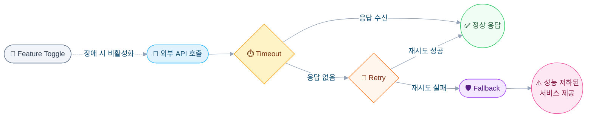

## 문제

챗봇 서비스는 복수의 외부 시스템에 의존한다.
- AI Agent(핵심 응답)
- OpenAI(STT 변환)
- EAIP(로그 동기화)
- Eloqua(CRM 연동)

각 외부 시스템은 독립적으로 장애가 발생할 수 있다. AI Agent 응답은 복잡한 쿼리의 경우 30\~60초가 소요된다. 사용자는 반드시 응답을 받아야 하며 로깅이나 동기화 같은 부수 작업은 메인 채팅 흐름을 방해해서는 안 된다.

## 4계층 방어 아키텍처



### Layer 1: 타임아웃 제어

| 컴포넌트 | 타임아웃 | 이유 |
|---------|---------|------|
| 연결 설정 | 5s | 외부 AI 서비스 연결 |
| 세션 생성 | 7s | 세션 초기화 최대 대기 |
| SSE 응답 | 65s | AI 스트리밍 최대 대기 (의도 분석 \→ RAG 검색 \→ 다중 Agent 응답) |
| DB 연결 획득 | 3s | 커넥션 풀 대기 |
| DB Idle 타임아웃 | 30min | 미사용 연결 자동 정리 |

**왜 SSE는 65s인가?** 복잡한 쿼리는 Intent → RAG Search → Multiple agent responses를 거친다. 30\~60초가 정상이므로 30초 이하로 설정하면 유효한 응답을 조기에 차단한다.

### Layer 2: 재시도 정책

| 설정 | 값 | 이유 |
|-----|-----|------|
| 최대 재시도 | 2회 | 3회 이상은 보통 영속적 장애 |
| 재시도 간격 | 500ms | 일시적 오류 복구에 충분한 속도 |
| 재시도 대상 | 네트워크 오류, 타임아웃, 일시적 5xx | |

```
1차 시도 → 실패 → 500ms 대기 → 2차 시도 → 실패 → Fallback
```

**재시도하면 안 되는 경우**
- 4xx 오류 (클라이언트 오류, 재시도해도 소용 없음)
- 비즈니스 로직 오류 (잘못된 입력, 권한 부족)
- 65초 이상 타임아웃 (이미 충분히 대기했음)

### Layer 3: Fallback (우아한 성능 저하)

**기능별 Fallback 전략**

| 기능 | Fallback | 사용자 영향 |
|-----|---------|-----------|
| AI 응답 | "현재 AI Agent 응답이 지연되고 있습니다. 잠시 후 다시 시도해 주세요." | 재시도 안내 |
| 대화 요약 | 간단 요약 생성 (LLM 없음) | 품질 저하 |
| 이벤트 로깅 | 로깅 스킵 | 없음 (사용자에게 투명) |
| 채팅 기록 저장 | 저장 스킵, 응답만 전달 | 없음 |
| 외부 시스템 동기화 (EAIP) | 상태 기록, 나중에 재시도 | 동기화 지연 |

**설계 원칙**
1. **핵심 기능 우선**: 사용자 응답 전달 > 부수 작업
2. **우아한 성능 저하**: 완전 장애가 아닌 부분 장애
3. **명확한 사용자 커뮤니케이션**: 무슨 일이 있었고 어떻게 하면 되는지 안내

### Layer 4: Feature Toggle

각 외부 시스템별 런타임 토글

| 기능 | 토글 | 비활성화 시 |
|-----|------|-----------|
| 견적 조회 (Eloqua) | eloqua.quotation.enabled | 제출 스킵, 성공 반환 |
| 로그 동기화 (EAIP) | eaip.enabled | 동기화 스킵 |
| AI 요약 (LLM) | llm.enabled | 간단 요약 사용 |

**왜 Circuit Breaker 대신 Feature Toggle인가?**
- Circuit Breaker는 자동 작동 (오탐지 가능)
- Toggle은 운영팀의 명시적 제어
- 예정된 유지보수 전에 사전 비활성화 가능
- 프로덕션 인시던트 시 직관적 대응

## 외부 시스템 격리

| 시스템 | 목적 | 장애 영향 | 격리 전략 |
|-------|------|---------|---------|
| AI Agent | 챗봇 응답 | 높음 (핵심) | 재시도 + Fallback 메시지 |
| Eloqua | 견적 제출 | 중간 | Feature Toggle |
| EAIP | 로그 동기화 | 낮음 | 상태 기록 + 나중에 재시도 |
| OpenAI | STT 변환 | 중간 | 오류 메시지 반환 |

### 오류 응답 표준화

```json
{
  "error": "AI_AGENT_ERROR",
  "message": "AI 응답 처리 중 오류가 발생했습니다",
  "timestamp": "2025-01-05T10:30:00"
}
```

| 오류 유형 | HTTP Status | 사용자 메시지 |
|---------|------------|------------|
| AI 서비스 오류 | 500 | AI 응답 처리 중 오류 발생 |
| 견적 오류 | 502 | 견적 제출 중 오류 발생 |
| 입력 검증 실패 | 400 | 입력 값이 유효하지 않습니다 |
| 내부 오류 | 500 | 내부 서버 오류가 발생했습니다 |

## WebFlux에서 부수 작업 격리

```java
// ❌ Bad: 부수 작업이 메인 스트림을 블로킹
.doOnNext(message -> {
    aiChatLogService.save(message).block(); // Event Loop 블로킹!
})

// ✅ Good: 별도 스케줄러에서 Fire-and-Forget
.doOnNext(message -> {
    aiChatLogService.save(message)
        .subscribeOn(Schedulers.boundedElastic())
        .subscribe();
})
```

**핵심 인사이트** — Reactive 스트림에서 비필수 작업은 절대 Event Loop를 블로킹해서는 안 된다. `boundedElastic` 스케줄러에서 Fire-and-Forget 패턴을 사용한다.

## 핵심 요약

1. **성공이 아닌 실패를 설계한다** — 모든 외부 호출은 실패할 수 있다
2. **데이터 완전성보다 사용자 응답을 우선한다** — 로깅 실패해도 응답을 전달한다
3. **방어 계층을 중첩한다** — 타임아웃 → 재시도 → Fallback → 토글
4. **Feature Toggle을 Circuit Breaker보다 선호한다** — B2B는 운영팀의 명시적 제어가 필요하다
5. **오류 응답을 표준화한다** — 모든 실패 모드에서 일관된 형식을 사용한다
6. **부수 작업은 절대 블로킹하지 않는다** — 로깅, 동기화, 분석은 Fire-and-Forget으로 처리한다
