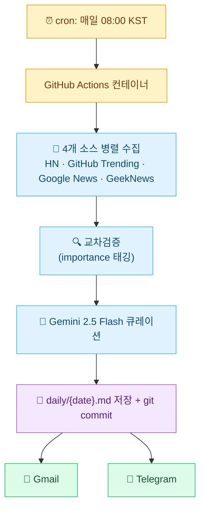

기존에 IT 뉴스레터를 몇 개 구독하고 있었는데 받아볼 때마다 양은 많지만 내가 관심 있는 주제로는 잘 좁혀지지 않고 인사이트까지 정리해주는 곳도 드물다는 게 늘 아쉬웠다. 마침 AI를 다양한 방식으로 굴려보고 싶었던 시점이라 직접 만들어보기로 했다.

---

## GitHub Actions라는 선택

처음엔 OpenClaw 같은 self-hosted AI 에이전트 환경에 끌렸다. 메신저랑 연결해서 24/7 비서처럼 굴리는 그림이 매력적이었지만 맥미니나 안 쓰는 노트북, 도커처럼 늘 켜둘 환경을 따로 마련해야 한다는 게 걸렸다. 매일 아침 뉴스 큐레이션 정도라면 그렇게까지 무거운 환경이 필요할까 싶었다.

GitHub Actions는 그 대안으로 떠올렸다. cron 한 줄을 설정해두면 매일 정해진 시간에 무료 컨테이너에서 스크립트가 돈다. 결과물을 git에 다시 commit해두면 repo 자체가 그대로 아카이브가 되고 cron 외에 다른 트리거(이슈 코멘트, PR 등)로 확장하기도 자연스럽다는 점이 좋아 보였다.

---

## 전체 파이프라인



코드는 약 500줄이고 의존성은 `requests`와 `google-generativeai` 정도로 가볍다.

---

## 수집 — 4개 소스

소스는 다음 네 곳을 골랐다.

- **Hacker News** — 글로벌 IT 트렌드. 점수 50점 이상으로 필터링해서 노이즈를 줄였다
- **GitHub Trending** — 개발 트렌드. 최근 1주일 내 생성된 인기 프로젝트 위주
- **Google News RSS** — 주류 IT 뉴스. 카테고리별 키워드로 검색
- **GeekNews** — 국내 개발자 커뮤니티. 한국어 뉴스 보강

이 네 개면 글로벌과 국내, 뉴스와 프로젝트가 한 번에 잡힌다. 추가할 후보는 더 있지만 일단 이 정도로 시작했다.

---

## 교차검증 — 같은 뉴스가 여러 곳에 뜨면 중요하다

여러 소스에서 동시에 뜨는 뉴스는 그날 실제로 중요한 사건일 가능성이 높다. 그래서 같은 뉴스가 두 군데 이상에서 발견되면 `importance: high` 태그를 붙여두고 큐레이션 단계에서 LLM이 그걸 주요 뉴스에 우선 포함하도록 시켰다.

같은 뉴스인지 판별하는 데는 두 가지 방법을 같이 쓴다.

1. **URL 정규화** — 도메인과 경로만 추출해서 query string이나 trailing slash 차이를 제거한 뒤 비교
2. **제목 키워드 겹침** — stopword 제거 후 더 짧은 쪽 키워드 기준으로 50% 이상 겹치면 같은 뉴스로 간주

```python
def _keyword_overlap(title_a, title_b, threshold=0.5):
    words_a = set(title_a.lower().split()) - stopwords
    words_b = set(title_b.lower().split()) - stopwords
    overlap = len(words_a & words_b)
    shorter = min(len(words_a), len(words_b))
    return (overlap / shorter) >= threshold
```

임베딩 같은 거 없이도 IT 뉴스처럼 키워드가 명확한 분야에서는 잘 잡힌다. 같은 사건을 다룬 영문 기사와 국문 기사가 키워드 일부 겹침으로 묶이는 경우도 꽤 있다.

---

## LLM 큐레이션 — 뻔한 인사이트 차단하기

수집한 뉴스를 그대로 내보내면 양도 많고 정리도 안 된다. 그래서 Gemini 2.5 Flash로 한국어 큐레이션을 한 번 거치는데 여기 들어가는 프롬프트가 결과 품질을 거의 다 결정했다.

특히 "오늘의 인사이트" 섹션이 까다로웠다. 별도 규칙 없이 시키면 LLM이 흔히 내놓는 뻔한 응답으로 채워졌다.

```
나쁜 예시 (이렇게 쓰지 마세요):
- "AI 도구를 활용하세요"
- "보안을 강화하세요"
- "최신 기술을 학습하세요"

→ 너무 뻔하고 구체성이 없음

좋은 예시:
- "WordPress 플러그인 공급망 공격이 늘고 있어요. 사용 중인 플러그인의
  소유권 변경 이력을 확인해보세요."
- "Claude Code Routines가 나왔는데, 반복적인 코드 리뷰나 테스트 자동화에
  바로 적용해볼 수 있어요."
```

좋은 예시와 나쁜 예시를 직접 보여주는 것만으로도 결과가 꽤 달라졌다. "구체적으로 작성하세요" 같은 추상적인 지시만으론 LLM이 잘 받아들이지 못했다.

### Fallback 처리

Gemini API는 가끔 죽는다. timeout, candidates 비어있음, MAX_TOKENS 도달, 일반 예외 네 가지 케이스를 모두 잡아서 fallback 브리핑(원본 뉴스 목록)으로 넘어가도록 했다.

```python
try:
    resp = requests.post(..., timeout=120)
    if resp.status_code != 200:
        return _fallback_briefing(...)
    candidates = result.get("candidates", [])
    if not candidates:
        return _fallback_briefing(...)
    ...
except requests.exceptions.Timeout:
    return _fallback_briefing(...)
except Exception as e:
    return _fallback_briefing(...)
```

LLM에 의존하는 자동화에서 가장 잘 깨지는 부분이 LLM 호출이다. 큐레이션이 실패해도 빈 메일이 가는 건 피하고 싶어서 원본 목록이라도 채워서 보내도록 해뒀다.

---

## 다채널 발송

Gmail과 Telegram 둘 다로 보내는데 각자 신경 써야 할 부분이 있다.

### Gmail — 마크다운 직접 HTML 변환

이메일 클라이언트에선 마크다운이 안 그려지니까 HTML로 변환해서 보내야 한다. markdown 라이브러리 안 쓰고 정규식으로 직접 변환했다. 제목, 링크, 리스트, blockquote, 테이블까지 다 처리하고 multipart/alternative로 plain과 HTML 둘 다 첨부한다.

라이브러리 안 쓴 이유는 GitHub Actions에서 의존성을 가볍게 가져가고 싶기도 했고 변환 결과를 직접 통제하고 싶기도 했기 때문이다. 결과적으로 100줄 안쪽에서 끝났다.

### Telegram — 4096자 제한과 마크다운 fallback

텔레그램 메시지는 한 통에 4096자가 한계인데 큐레이션 결과물이 보통 5000~8000자라 분할이 필요하다. 무작정 자르면 마크다운이 깨지니까 줄바꿈 기준으로 자르도록 했다.

```python
cut = text[:MAX_MESSAGE_LENGTH].rfind("\n")
if cut == -1:
    cut = MAX_MESSAGE_LENGTH
```

`parse_mode: "Markdown"`으로 보낼 때 한 가지 더 신경 써야 할 게 있다. Gemini가 가끔 백틱 짝이 안 맞는 응답을 만들어내는데 그러면 마크다운 파싱이 깨져서 발송 자체가 실패한다. 그래서 마크다운으로 보내다 실패하면 plain text로 한 번 더 시도하도록 fallback을 걸어뒀다.

---

## 마무리 — 확장 가능성

지금은 매일 아침 뉴스 한 통뿐이지만 GitHub Actions가 cron 외에도 다양한 트리거를 지원하니 같은 패턴으로 확장할 여지가 많다.

- PR 열리면 자동 코드 리뷰와 코멘트
- 이슈에 라벨 붙으면 관련 문서 검색해서 코멘트
- 매주 월요일 아침에 지난주 commit 요약
- 외부 webhook 받아서 처리

self-hosted 환경 없이 자동화 파이프라인을 GitHub Actions 위에서 굴려본 게 처음이었는데 1인용으로 가볍게 돌리는 데는 부족함이 없었다. 더 무거운 작업이나 항상 듣고 있어야 하는 시나리오가 필요해지면 그때 OpenClaw 같은 환경으로 옮겨갈 생각인데 지금 수준에서는 손도 별로 안 가고 한 달째 잘 굴러가고 있다.
