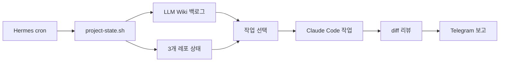

이전 글들에서 LLM Wiki를 코드 에이전트를 위한 외장 두뇌로 만들고, 그 위에 어떤 도구를 얹을지 기준을 정했다. 프로젝트별 index를 두고, 결정 문서와 API 계약을 연결하고, 새 세션의 에이전트가 먼저 그 문서를 읽게 하는 구조다.

그 구조는 효과가 있었다. 다만 어디까지나 사람이 의식적으로 남기는 정적인 저장소였다. 백로그를 정리하고, 오늘 할 일을 고르고, 작업을 맡기고, 결과를 검토해 보고하는 일은 여전히 사람이 루프를 돌려야 했다.

그래서 이번에는 그 루프를 Hermes Agent로 자동화해봤다. 핵심은 Hermes가 모든 코드를 직접 작성하게 만드는 것이 아니다. LLM Wiki의 백로그를 읽고, 작업을 고르고, 필요한 코드 도구를 호출하고, 결과를 Telegram으로 보고하는 오케스트레이터로 쓰는 것이다.

---

## Hermes의 역할 — 코더가 아니라 오케스트레이터

Hermes Agent는 Nous Research에서 만든 AI 에이전트다. 이 글에서 Hermes에 기대한 역할은 코딩 능력이 아니라 지속 실행 능력이다. gateway와 scheduler를 쓰려면 백그라운드 프로세스가 필요하고, cron으로 정기 실행할 수 있고, MCP와 Telegram을 붙일 수 있다. 이 세 가지가 맞으면 개인 하네스의 오케스트레이터로 쓸 수 있다.

앞선 글에서 OpenClaw는 보류했다. OpenClaw로도 위키를 읽고, 도구를 호출하고, 정해진 시간에 작업을 돌리는 구조는 만들 수 있다. 보류한 이유는 가능 여부가 아니었다. 처음 접했을 때 보안과 격리 환경을 함께 고려해야 한다는 인상이 강했고, 현 시점에서 내가 바로 손에 익히기에는 Hermes의 사용성이 더 좋아 보였다.

Hermes는 호스트에 `uv tool`로 설치하고, 기존 레포와 LLM Wiki를 그대로 읽고, cron으로 정해진 시간에 돌리는 식으로 시작할 수 있었다. OpenClaw가 못 하는 일을 Hermes가 한다기보다, 지금 내 환경에서는 Hermes의 gateway, scheduler, memory를 중심으로 좁게 운용하는 그림이 더 잘 그려졌다.

또 하나 끌렸던 지점은 Hermes 자체의 self-improving 특성이다. 사용자 프로필, 메모리, 시스템 프롬프트가 시간 지나면서 누적되고 큐레이터가 주기적으로 정리한다. 단순히 cron을 실행하는 스케줄러가 아니라, 운영하면서 나에게 맞는 기억과 절차를 쌓아갈 수 있다는 점이 흥미로웠다. 다만 이 글에서는 그 가능성을 결론처럼 말하기보다, 실제로 매일 도는 실행 루프를 만든 경험에 초점을 둔다.

셋업은 호스트에 uv tool로 깔았다.

```bash
uv tool install hermes-agent --with mcp
hermes postinstall
hermes quick-setup
```

처음엔 Gemini Flash provider로 시작했다가 ChatGPT Plus OAuth로 갈아탔다. 핵심 이유는 중복 과금을 피하는 것이었다. Gemini는 구독해서 쓰고 있었지만, Hermes에서는 API key 기반 호출로만 붙일 수 있어서 내가 가진 구독은 사실상 의미가 없었다. 반면 ChatGPT Plus OAuth는 API 과금 방식이 아니라 이미 결제한 ChatGPT 구독을 활용할 수 있어서 Gemini 구독을 해지하고 이쪽으로 정리했다.

사용 모델은 `gpt-5.4-mini`로 잡았다. 더 무거운 모델은 자율 워크플로에서 응답 지연이 자주 났다.

컨텍스트 시드는 세 파일에 박아뒀다. `~/.hermes/SOUL.md`에 시스템 프롬프트, `~/.hermes/memories/USER.md`에 사용자 프로필, `~/.hermes/memories/MEMORY.md`에 도구 활용 정책. 새 세션이 시작될 때마다 이 셋이 자동으로 로드된다. 그 위에 내가 학습한 내용이 누적되는 식이다.

---

## 하루 한 번 작업을 시작하는 시스템

다음으로 본 게 cron 자동화였다. Hermes에는 `hermes cron` 명령이 내장되어 있어서 정기 작업을 등록할 수 있다. 나는 하루 여러 번 트리거를 걸어두고, state guard로 실제 작업은 하루 한 번만 시작하게 했다. 사전 정의된 스크립트가 상태를 수집하면, 그 결과를 가지고 LLM이 워크플로를 실행한다. 결과는 Telegram으로 발송된다.

만들고 싶었던 것은 다음과 같다.

- 매일 정해진 시간에 자동 트리거
- 진행 중인 개인 챗봇 프로젝트의 백로그를 본다
- 우선순위 높은 작업 하나 픽업한다
- 작업 브랜치를 만들고 코드 작업을 진행한다
- 검토받고 임시 커밋한다
- 결과를 Telegram으로 보고한다

사용자 개입이 필요한 시점은 마지막 한 곳뿐이다. 보고를 받고 main에 머지할지 폐기할지만 결정하면 된다.

백로그는 LLM Wiki에 두기로 했다. 이미 외장 두뇌로 쓰고 있는 곳이고, 여러 레포에 흩어진 작업을 한 곳에서 관리할 수 있다. 백로그 파일에는 High/Medium/Low/Idea로 우선순위 섹션을 두고, 각 작업에 `[agent]`, `[core]`, `[mobile]` 같은 레포 태그를 붙였다. 에이전트가 작업 시작하면 In Progress 섹션으로 옮기고, 끝나면 Done으로 이동한다.



상태 수집은 `project-state.sh`라는 쉘 스크립트로 분리했다. 이 스크립트는 두 가지 일을 한다.

```bash
# 1. State guard — 오늘 이미 실행됐으면 빈 stdout
TODAY=$(date +%Y-%m-%d)
if [ -f "$STATE_FILE" ] && [ "$(cat "$STATE_FILE")" = "$TODAY" ]; then
    exit 0
fi
echo "$TODAY" > "$STATE_FILE"

# 2. 백로그 + 3 레포 git 상태 수집
cat "$BACKLOG"
for repo in agent core mobile; do
    cd "$REPO_PATH/$repo"
    git status -sb
    git log -1 --oneline
done
```

매일 3번 등록된 트리거(9시, 15시, 21시) 중에서 첫 번째 트리거에만 실제로 작업을 시작한다. PC가 꺼져있을 시간을 보완하기 위해 여러 시점을 등록했다. State guard 파일이 그날 실행됐는지 표시하는 역할을 한다.

워크플로 자체는 prompt 파일에 4단계로 압축해뒀다. 백로그 픽업 → 작업 진행 → 백로그 갱신 → 최종 보고. cron 등록은 다음 한 줄이면 끝난다.

```bash
hermes cron create '0 9,15,21 * * *' \
  --name project-auto \
  --workdir ~/development/project/my-assistant \
  --script project-state.sh \
  --deliver telegram \
  "$(cat ~/.hermes/scripts/project-auto-prompt.txt)"
```

---

## 역할을 세 층으로 나눴다

여기서 한 가지 결정이 갈렸다. 코드 작업을 Hermes가 직접 할 것인가, 다른 도구에 위임할 것인가.

처음에는 Hermes가 백로그 픽업부터 코드 수정까지 전부 맡는 그림도 생각했다. 하지만 지금 구성에서는 역할을 세 층으로 나눴다. Hermes는 cron, 상태 수집, 보고를 맡는 런타임이다. Hermes 내부 판단에는 ChatGPT/Codex 계열 provider를 쓴다. 실제 코드 수정은 Claude Code CLI에 위임했고, 변경 검토는 별도 CLI 호출로 한 번 더 확인했다.

이렇게 쓰면 "Hermes와 Codex가 다른 도구인가?"라는 질문이 생길 수 있다. 엄밀히 말하면 다르다기보다 레이어가 다르다. Hermes는 에이전트 런타임이고, Codex/ChatGPT 계열 모델은 Hermes가 판단할 때 쓰는 provider다. 아래 표에서 말하는 Codex는 Hermes 내부 모델이 아니라, `git diff`를 받아 리뷰만 수행하는 별도 CLI 호출을 뜻한다.

| 도구 | 맡긴 일 | 이유 |
|---|---|---|
| Hermes | 백로그 픽업, 브랜치 생성, 실행 흐름 관리, 보고 | cron과 Telegram까지 이어지는 오케스트레이션에 적합 |
| ChatGPT/Codex provider | Hermes 내부 판단 | OAuth 기반 구독 활용, 백로그 선택과 실행 흐름 판단 |
| Claude Code | 실제 코드 수정 | 코드 작업 품질과 기존 사용 경험 |
| Codex CLI | diff 리뷰 | 커밋 전 검토 루프에 적합 |

워크플로 안에서 Hermes가 Claude Code와 Codex CLI를 subprocess로 호출하는 패턴이다. Hermes는 가벼운 오케스트레이터 역할만 한다.

```bash
# Hermes prompt 안에서 LLM이 만들어 실행하는 명령
echo "<작업 내용>" | claude --print --permission-mode acceptEdits --add-dir <레포 경로>
git diff | codex exec --sandbox read-only "이 diff 리뷰. 한국어 3줄 이내."
```

여기서 Claude Code는 토큰을 빼내서 Hermes에 붙이는 방식이 아니라, 로컬에 설치된 공식 CLI를 subprocess로 호출하는 방식이다. Claude Code의 headless 실행(`--print`) 자체는 CLI 문서에 있는 기능이고, Pro/Max 구독으로 Claude Code를 터미널에서 쓰는 것도 공식적으로 지원된다.

다만 이 조합은 보수적으로 다루는 편이 맞다고 봤다. Hermes가 Claude CLI를 대신 호출하면 구조상 "구독형 Claude Code를 자동화 워크플로 안에서 쓰는 것"에 가까워진다. 구독형 CLI의 허용 범위와 자동화 정책은 언제든 바뀔 수 있고, 특히 API 사용량을 대체하려는 방식으로 대량 또는 무인 운용하는 경우에는 정책 리스크가 생길 수 있다.

그래서 이 흐름은 개인 작업 환경에서 낮은 빈도로 돌리고, 결과를 Telegram으로 받은 뒤 사람이 merge 여부를 결정하는 선으로 제한했다. 애초에 이 구성을 생각한 이유도 현재 Claude Code는 Max, Codex는 Plus로 쓰고 있어서 Claude Code 쪽 quota를 더 활용하고 싶었기 때문이다. 다만 장기적으로 더 안전하게 운영하려면 Claude Code 구독 호출 대신 Anthropic API나 공식 Agent SDK 쪽으로 옮기거나, Codex를 더 높은 요금제로 올리고 Hermes 내부 provider가 코드 작업까지 직접 수행하게 하는 쪽이 맞을 수 있다.

`bypassPermissions`처럼 권한 확인을 모두 건너뛰는 모드도 격리된 컨테이너나 VM에서만 쓰는 편이 낫다. 공개 글의 예시는 파일 수정은 허용하되 보호 경로와 위험한 명령은 계속 막는 `acceptEdits` 기준으로 적었다.

이렇게 분담하면 Hermes는 흐름을 관리하고, 무거운 코드 작업은 Claude Code가 맡고, 변경 검토는 별도 CLI가 맡는다. 자동화가 한 레이어에 과하게 기대지 않아서 루프가 단순해졌다.

---

## 구축하면서 알게 된 것들

처음부터 잘 돌지는 않았다. 첫 번째 실행은 약 12분이 걸렸고 그중 10분이 응답 대기로 날아갔다. 메인 LLM 호출이 5분간 응답이 없어서 timeout으로 죽고, 자동 재시도로 살아나는 패턴이 두 번 반복됐다. 작업 결과물도 어중간했다.

원인은 ChatGPT/Codex backend의 first-token latency였다. 컨텍스트가 누적될수록 첫 응답까지 시간이 길어지는 경향이 있다. 모델 자체의 무게 문제는 아니라고 봤다. 가벼운 모델(`gpt-5.4-mini`)로 바꿔도 같은 패턴이 재현됐다.

몇 가지 조정을 거치면서 안정화됐다.

- Auxiliary timeout을 30초에서 90초로 늘렸다. 첫 토큰이 늦는 보조 호출이 timeout으로 끊기는 문제가 줄었다
- Prompt를 8단계에서 4단계로 압축했다. Hermes가 중간 상태를 과하게 들고 가는 일이 줄었다
- Subprocess 결과는 한 줄 요약만 다음 단계로 넘기게 했다. Claude Code 출력이 그대로 다음 LLM 입력으로 들어가며 컨텍스트가 커지는 문제를 막았다
- `claude --print`는 stdin 방식으로 호출했다. 명령 인자 누락보다 pipe 입력이 안정적이었다

이 정도 조정 후 같은 작업이 5분 안에 끝나기 시작했다. Telegram에 정해진 형식으로 보고가 도착한다.

```
📋 작업: my-assistant-agent/.env.example 파일 생성
🌿 브랜치: my-assistant-agent/project-auto-20260525-1705
📝 변경: 1개 파일
🔍 Codex: OK
⏭️ 다음: 확인 후 main에 merge 또는 폐기
```

---

## 아직 검증 중인 것

여기까지는 실제로 구축해서 돌려본 범위다. 아직 검증 중인 질문도 남아 있다.

첫째, Hermes의 self-improving 특성이 cron 워크플로 품질을 실제로 끌어올리는지 봐야 한다. 어떤 작업에서 어떤 도구가 잘 동작했는지, 어떤 prompt 패턴이 안정적이었는지가 메모리에 쌓이고 다음 실행에 반영되는지가 관찰 포인트다.

둘째, LLM Wiki 백로그가 어느 정도까지 운영 단위로 버틸 수 있는지 확인하고 싶다. 개인 백로그에서는 파일 하나면 충분하지만, 작업이 늘어나면 우선순위, 상태 이동, 완료 기준, 리뷰 흐름을 더 엄격하게 관리해야 한다.

셋째, 자동화 범위가 늘어날수록 사람이 확인해야 하는 경계도 같이 정해야 한다. 지금은 Telegram 보고를 받고 main에 머지할지 폐기할지 결정하는 지점을 사람에게 남겨뒀다. 이 선을 어디까지 밀어도 되는지는 더 운영해봐야 한다.

넷째, 코드 작업을 어느 레이어에 맡기는 게 장기적으로 맞는지도 다시 봐야 한다. 지금은 Claude Code Max를 적극 활용하려고 Claude CLI를 subprocess로 호출했지만, 정책 리스크와 운영 단순성을 생각하면 Codex 요금제를 올리고 Hermes의 ChatGPT/Codex provider가 코드 작업까지 직접 수행하게 하는 구성이 더 나을 수도 있다. 이 경우 Hermes가 백로그 선택, 코드 변경, 보고까지 한 런타임 안에서 처리하고, 별도 CLI 호출은 최소화된다.

---

## 마무리

LLM Wiki가 외장 두뇌라면 Hermes는 그 위에서 매일 한 번 루프를 돌리는 실행 장치에 가깝다. 백로그를 읽고, 작업을 고르고, Claude Code에 수정 작업을 맡기고, 별도 diff 리뷰를 거친 뒤, Telegram으로 결과를 보내는 흐름까지 이어졌다.

중요했던 것은 한 런타임에 모든 역할을 억지로 밀어 넣지 않은 점이다. Hermes는 오케스트레이션과 보고를 맡고, 실제 코드 변경과 리뷰는 현재 내가 가장 잘 쓰는 경로에 맡겼다. 이 레이어 분리 덕분에 자동화가 무거워지지 않았다.

아직 완성된 시스템은 아니다. self-improving 메모리가 실제 운영 품질을 얼마나 끌어올리는지, LLM Wiki 백로그가 계속 운영 단위로 버틸 수 있는지는 더 봐야 한다. 그래도 LLM Wiki에 쌓인 정적인 컨텍스트가 매일 실행되는 루프로 연결됐다는 점에서, 1인 하네스는 한 단계 더 구체적인 형태를 갖기 시작했다.

### 1인 하네스 엔지니어링 시리즈

- 이전 1편: [코드 에이전트를 위한 LLM Wiki — 1인 하네스의 외장 두뇌 만들기](/blog/llm-wiki-coding-agent-knowledge-base)
- 이전 2편: [1인 하네스 엔지니어링 — 도구가 늘어날 때 기준 세우기](/blog/harness-engineering-framework-selection)
- 현재: Hermes Agent 도입기
