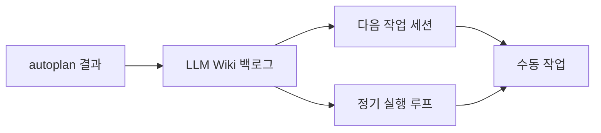

[지난 글](/blog/llm-wiki-coding-agent-knowledge-base)에서는 코드 에이전트가 공유할 외장 두뇌로 LLM Wiki를 만들었다. 세션이 바뀌어도 결정 이력과 API 계약을 다시 읽을 수 있게 되자, 다음 문제는 컨텍스트가 아니라 도구 쪽에서 생겼다.

요즘 코드 에이전트 프레임워크는 너무 빠르게 늘어난다. gstack, ECC(Everything Claude Code), OpenClaw 같은 이름들이 계속 보이고, 각각의 설명만 읽으면 다 좋아 보인다. 하지만 1인 환경에서 도구를 무작정 늘리면 생산성이 오르기보다 기억해야 할 것만 늘어난다.

그래서 이번 글에서는 새로운 프레임워크를 어떻게 평가하고, 무엇을 남기고, 무엇을 미뤘는지 정리한다. 핵심은 더 많이 설치하는 것이 아니라 실제 워크플로우에 들어올 수 있는 도구만 남기는 것이다.

---

## 잠깐 살펴본 것들

몇 가지 프레임워크를 살펴봤다.

- **gstack** (Garry Tan/YC) — 27개 도구 묶음. CEO/eng/design 리뷰, ship, qa, codex, retro 같은 워크플로우 도구. 가장 실제로 써본 것
- **ECC (Everything Claude Code)** — 60 agents + 229 skills + 16 hooks 거대 패키지. 통째로 들이긴 부담
- **OpenClaw** — self-hosted AI 에이전트 플랫폼. 로컬에서도 쓸 수 있지만, 처음 접했을 때는 보안과 격리 환경을 함께 고려해야 한다는 인상이 강해서 도입 보류

이 외에도 새 프레임워크가 계속 나온다. 다 들여보면 좋겠지만 시간이 없고 그럴 만한 이유도 없다.

---

## 모두 다 좋아 보인다는 함정

각 프레임워크의 description을 읽으면 다 좋아 보인다. 많은 도구, 강력한 기능, 멋진 워크플로우 사례. 그런데 실제로 들여보면 다른 그림이 펼쳐지는 것 같다.

내 환경엔 이미 SuperClaude가 깔려있다. 24 agents, 34 skills, 7 modes, 7 MCP. 그 위에 gstack 27개 도구를 더 깔고 추가로 ECC 60 agents까지 들이면 머리에 담을 게 너무 많아진다. 자주 쓰는 도구 외엔 "있는지조차 모르는" 상태가 된다. gstack을 깔아두고 정말 잘 쓰고 있는지 의심이 든 게 이 글을 쓰게 된 계기 중 하나였다.

게다가 self-hosted 프레임워크(OpenClaw 같은)는 단순 CLI 도구보다 운영 모델을 더 넓게 봐야 한다. OpenClaw를 보류한 이유는 기능이 부족해서가 아니었다. 위키를 읽고, 도구를 호출하고, 정해진 시간에 작업을 돌리는 구조는 OpenClaw로도 만들 수 있다.

다만 처음 접했을 때는 별도 VM이나 격리 환경에서 다루라는 글을 많이 봤고, 내가 그 보안 모델을 충분히 이해하지 못한 상태에서 바로 들이기엔 부담이 있었다. 이번에 다시 보니 permission, sandbox, network control 같은 장치도 갖추고 있어서 로컬에서도 충분히 활용할 수 있는 플랫폼이었다. 그럼에도 이 시점에서 중요하게 본 것은 기능 가능 여부보다 내가 이해하고 운영해야 할 표면이었다.

---

## 내 기준 만들기

외부 프레임워크를 평가하는 내 기준 네 가지를 정리했다.

### 1. 자주 손이 가는가

가장 먼저 본 것은 실제 사용 빈도다. 설명이 좋은 도구보다 내가 자주 꺼내 쓰는 도구가 더 중요했다. 자주 손이 간다는 건 그 도구를 부를 상황이 분명하고, 호출 방법이 기억나고, 결과가 다음 작업으로 이어진다는 뜻이다.

반대로 설치해두고 거의 부르지 않은 도구는 이유가 있었다. 사용 시점이 애매하거나, 호출 비용이 크거나, 결과가 내 작업 흐름으로 이어지지 않았을 가능성이 높다. 그래서 "좋아 보이는가"보다 "실제로 손이 가는가"를 더 강한 신호로 봤다.

### 2. 역할이 겹치지 않는가

다음으로 본 것은 중복성이다. 요즘 에이전트 프레임워크는 agents, skills, hooks, MCP를 묶어서 제공하는 경우가 많다. 문제는 새 패키지를 들일수록 비슷한 일을 하는 도구가 여러 개 생긴다는 점이다.

예를 들어 코드 리뷰, 계획 수립, 회고, 문서 정리 같은 기능은 SuperClaude, gstack, ECC 계열에서 서로 겹치기 쉽다. 역할이 겹치면 선택지가 늘어나는 게 아니라 매번 무엇을 불러야 할지 판단해야 하는 비용이 늘어난다. 그래서 이미 잘 쓰는 도구가 있는 영역에는 새 도구를 쉽게 추가하지 않는다.

### 3. 도입 단위와 운영 표면

먼저 보는 것은 기능 수가 아니라 운영해야 할 표면이다. 설치가 얼마나 큰지, 별도 서버가 필요한지, 인증과 권한을 계속 관리해야 하는지, 문제가 생겼을 때 내가 어디까지 디버깅해야 하는지를 본다.

1인 환경에서는 도구 자체의 기능보다 유지 비용이 더 빨리 병목이 된다. 아무리 좋은 도구라도 계속 켜둘 인프라, 별도 관리 콘솔, 권한 체계, 업데이트 부담이 붙으면 당장 풀려는 문제보다 운영해야 할 면적이 커진다.

### 4. 호출 비용과 실패 비용

도구마다 한 번 호출의 비용이 다르다. 가벼운 도구는 1분짜리 결과를 받기 좋고 무거운 도구는 30분에서 1시간씩 잡힌다. 무거운 도구는 "큰 결정"에만 쓰고 일상 작업엔 가벼운 도구가 맞는 것 같다.

여기서 비용은 시간만이 아니다. 토큰, quota, 기다리는 동안의 컨텍스트 전환, 잘못 호출했을 때 되돌리는 비용까지 포함된다. 그래서 무거운 도구는 일상 작업이 아니라 에픽, 설계 변경, 회고처럼 호출 비용을 회수할 수 있는 지점에만 둔다.

### 기준을 적용하는 방식: 워크플로우 편입성

도구의 description만 보고는 진짜 어떤 작업에 맞는지 알기 어렵다. 내가 자주 하는 작업 흐름과 각 도구가 어느 시점에 발동되어야 하는지 매핑해야 진짜 활용 가능한 것 같다.

여기서 자동 발동인지 명시 호출인지는 도구의 본질이라기보다 운영 방식에 가깝다. 중요한 것은 내가 그 도구를 떠올릴 수 있는 위치가 워크플로우 안에 있느냐다. 그래서 도구 목록을 외우는 대신 "작업 시점 → 부를 도구" 형태로 CLAUDE.md에 남겼다.

---

## 내 환경에서 실제 정리한 것

위 기준으로 실제로 환경을 정리했다.

### MCP 제거 (4개)

| MCP | 제거 이유 |
|---|---|
| obsidian | vault 직접 read/write가 더 빠르고 정확 |
| terraform | 사실상 안 씀 |
| apidog | 요새 안 씀 |
| aws-core | AWS CLI로 작업이 충분하고 인증도 만료된 채 방치되어 있었다 |

aws-core 케이스는 내가 가장 놀란 부분이었다. `claude mcp list`로 점검하기 전엔 깔려있다는 사실 자체를 인지하지 못했다. 한 번 깔아두고 안 쓰면 나도 모르게 안 쓰는 도구가 쌓이니까 정기 점검이 필요해 보인다.

### gstack 5개 선별

27개 도구 중 자주 쓸 5개만 CLAUDE.md 활용 가이드에 명시했다. 나머지는 설치는 그대로 두지만 명시적으로 안 부른다.

| 시점 | 도구 | 트리거 표현 |
|---|---|---|
| 새 기능 1차 검토 | office-hours | "이 아이디어 같이 생각해보자" |
| 에픽/새 프로젝트 (큰 결정만) | autoplan | "에픽 검토" |
| PR 전 코드 리뷰 | review | "PR 리뷰" |
| 배포 시작 | ship | "ship" |
| 주간 회고 | retro | "이번 주 뭐 했지" |

핵심은 27개 도구를 다 외우지 않는 것이다. 자주 쓰는 시점에 어떤 도구를 부를지만 가이드로 박아두면, 도구 목록이 아니라 작업 흐름을 따라가면서 필요한 도구를 떠올릴 수 있다.

### ECC는 hook만 차용 검토

60 agents/229 skills는 SuperClaude + gstack과 상당 부분 겹친다고 본다. 코드 리뷰, 계획 수립, 문서화, 회고처럼 이미 다른 도구로 처리하는 영역이 많았다. 진짜 비어있는 영역은 hook 시스템이라 그것만 가져오면 가치가 있겠다 싶었다. 다만 ECC hook 자체가 의존성이 묶여있어서 통째 설치 없이 떼서 쓰기 어렵다. 결국 ECC에서 영감만 받고 내 환경에 맞춰 직접 hook을 작성하는 게 더 깨끗할 것 같다. 이건 아직 작업 안 했지만 다음 시도 영역으로 남겨뒀다.

---

## gstack 활용 깊이는 아직 얕다

솔직히 인정해야 할 부분이 있다. gstack을 내가 정말 깊이 활용하고 있는가 하면 아직 얕다고 본다. 5개 선별해서 가이드에 박아뒀어도 실제로는 ship, review 정도가 일상에 자리잡았고 office-hours나 retro는 아직 한 번도 제대로 돌려보지 못했다.

찾아보니 Garry Tan 본인은 gstack을 Think → Plan → Build → Review → Test → Ship → Reflect의 루프로 쓰고 있었다. 27개 도구가 단순한 묶음이 아니라 시퀀스로 작동하는 모양이다.

내 활용은 이 루프의 일부(Build → Review → Ship)에만 머물러 있다. Think와 Plan 단계의 도구들(office-hours / autoplan)은 무거워서 자주 못 부르고 Reflect 단계의 retro는 아직 습관이 안 됐다. 활용 깊이가 얕은 게 도구의 문제가 아니라 내가 루프 전체를 운영하는 습관을 못 만들었기 때문이라는 게 정확한 평가일 것 같다.

결국 도구는 설치보다 루프에 편입되는지가 중요했다. 어떤 시점에 어떤 도구를 자연스럽게 부르는지 그 패턴이 잡혀야 가이드의 가치가 살아난다.

---

## 도구를 직접 사용해보고 알게 된 것

활용 가이드를 만든 다음 실제로 autoplan을 한 번 돌려봤다. 1.5~2시간 들여서 받은 결과인데 내가 의도한 것과 빗나갔다.

내가 원했던 건 "현재 프로젝트의 종합 상태 평가"였는데 도구가 낸 결과는 "지난 한 달 약속 이행 추적"에 가까웠다. 사후에 보니까 이유가 분명했다. autoplan은 plan 문서를 받아서 그 plan을 검토하고 추적하는 도구다. "현재 상태 평가"는 그 도구의 본질이 아니었다.

이걸 알게 된 게 활용 가이드를 만든 것보다 더 중요한 학습이었다고 본다. 도구 description만 보고는 본질을 정확히 알기 어렵고 한 번 호출해봐야 알게 되는 것 같다. 1인 환경에선 이 "체득 비용"을 미리 계산해야 한다. 무거운 도구일수록 한 번 잘못 부르면 시간 손해가 크다.

다행히 정리한 활용 가이드의 "에픽/새 프로젝트만 autoplan" 룰은 그대로 유효하다. 다만 거기에 "plan 문서를 도구 본질에 맞게 잘 만들어서 들어가야 한다"는 조건이 추가됐다.

이 경험 때문에 도구 선별의 기준이 조금 더 분명해졌다. 좋은 도구를 설치하는 것만으로는 부족하고, 그 도구가 언제 호출되고 결과가 어디로 흘러가는지까지 정해야 한다. 이 지점에서 정기 실행 루프와 백로그 자동화가 다음 문제로 떠올랐다.

---

## plan이 LLM Wiki 백로그로 이어져야 하는 이유

autoplan을 잘 부르는 것은 시작이지 끝이 아닌 것 같다. 도구가 plan을 만들어줘도 그게 markdown 문서로 끝나면 실제 실행으로 이어지지 않는다. 나는 이 단계에서 가장 많이 막혀왔다. 좋은 plan을 받아두고도 정작 다음 주에 그 plan을 까먹거나 일부만 진행하고 나머지는 묻혔다.

생각해보면 이게 1인 환경에서 가장 큰 누수 지점이다. 계획을 받는 순간에는 만족스럽지만, 그 계획이 다음 작업 세션의 입력으로 들어가지 않으면 결국 다시 잊힌다.

그래서 plan의 결과는 별도 작업 관리 시스템보다 LLM Wiki의 백로그 문서로 모으는 편이 현재 환경에는 더 맞다. 이미 프로젝트별 결정 문서와 컨텍스트가 LLM Wiki에 있고, 에이전트도 새 세션에서 그곳을 먼저 읽는다. 실행할 작업까지 같은 곳에 두면 컨텍스트와 백로그가 분리되지 않는다.

원하는 흐름은 이렇게 바뀌었다.

이 지점에서 다음 후보로 Hermes Agent를 살펴봤다. 필요한 실행 루프를 작게 붙여볼 수 있어 보였고, 실행 경험을 다음 실행에 반영하는 self-improving 구조도 궁금했다.

---

## 마무리

LLM Wiki를 만들고 나니 컨텍스트를 어디에 둘지는 어느 정도 정리됐다. 하지만 컨텍스트만으로는 일이 진행되지 않는다. 어떤 도구를 언제 부르고, 어떤 도구는 과감히 빼고, 무거운 도구는 어느 시점에만 쓸지 정해야 했다.

이번에 정리한 기준은 단순하다. 자주 손이 가는가, 이미 쓰는 도구와 역할이 겹치지 않는가, 운영해야 할 표면이 감당 가능한가, 호출 비용을 회수할 만큼 중요한 작업인가. 이 기준으로 보니 도구를 더 설치하는 것보다 안 쓰는 도구와 중복되는 도구를 걷어내고, 남은 도구를 흐름에 편입시키는 일이 더 중요했다.

다음 문제는 실행이다. 도구를 골랐다면, 이제 LLM Wiki 백로그를 읽고 작업을 고르고 결과를 보고하는 루프를 어떻게 자동화할지 봐야 한다. 이 흐름이 Hermes Agent 도입으로 이어졌다.

### 1인 하네스 엔지니어링 시리즈

- 이전: [코드 에이전트를 위한 LLM Wiki — 1인 하네스의 외장 두뇌 만들기](/blog/llm-wiki-coding-agent-knowledge-base)
- 현재: 1인 하네스 엔지니어링
- 다음: [Hermes Agent 도입기 — LLM Wiki 위에 자율 실행 루프 얹기](/blog/harness-automation-with-hermes-agent)
