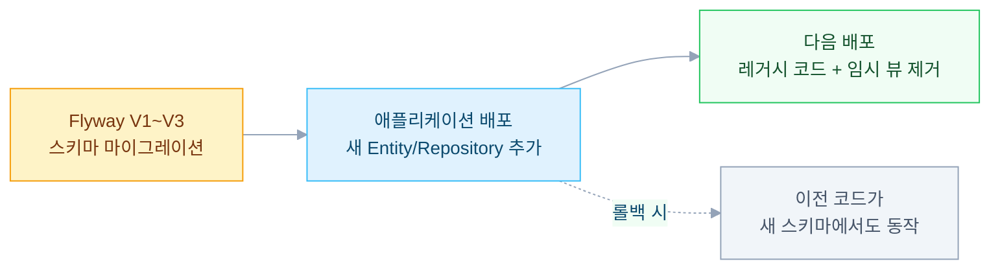

멀티 에이전트 시스템에서 병렬 실행을 구현하면 응답 속도는 빨라진다. 하지만 **데이터 모델이 복잡해진다.** 사용자 1명의 메시지에 대해 5~6개의 에이전트가 동시에 응답하면 피드백(👍/👎)을 어느 응답에 연결할지 불명확해진다. 어드민 대시보드도 채팅 로그를 조각 단위로 보면 전체 흐름을 이해하기 어렵다.

메시지 그룹핑을 통해 사용자 요청 + 모든 에이전트 응답을 하나의 단위로 다루고 Flyway 5단계 마이그레이션으로 무중단 배포한 경험을 정리했다.

---

## 문제: 1:N 응답과 피드백 추적의 어려움

초기 설계에서는 메시지가 프래그먼트 단위로 저장되었다.

```
User: "이 제품 추천해줘"
├─ Fragment 1: Intent 분류 결과
├─ Fragment 2: 인사 메시지
├─ Fragment 3: 제품 설명 (텍스트 에이전트)
├─ Fragment 4: 제품 비교 (비교 에이전트)
├─ Fragment 5: 핵심 포인트 (요약 에이전트)
└─ Fragment 6: 비교 테이블 (테이블 에이전트)
```

### 발생한 문제들

1. **피드백 매핑 불명확** — 사용자가 👍을 클릭할 때 어느 프래그먼트에 대한 피드백인가?
2. **어드민 모니터링 어려움** — 전체 메시지 흐름을 보려면 6개 프래그먼트를 각각 조회해야 한다
3. **외부 시스템 동기화 복잡** — 외부 로그 시스템은 프래그먼트 개념이 없고 메시지 단위로 동작한다
4. **메타데이터 추적 불가** — 토큰 사용량, 모델 이름, 에러 상태가 어느 메시지에 속하는지 불명확하다

---

## 설계: message_id 기반 그룹핑

**핵심 아이디어**: 사용자의 1개 메시지에 `message_id`라는 그룹 식별자를 부여한다. 그 안에 여러 `message_fragment_id`가 포함된다.

### 테이블 재설계

| Before | After | 역할 |
|---|---|---|
| `chat_log` | `external_chat_log` | 외부 시스템 동기화 기록 |
| `feedback_log` | `external_feedback_log` | 외부 시스템 피드백 기록 |
| `chat_message_log` | `chat_message_fragment` | 개별 프래그먼트 (메타데이터) |
| (신규) | `chat_message` | 메시지 그룹 (어드민 뷰) |

### chat_message_fragment 테이블 (변경사항)

```sql
-- 그룹 식별자 추가
message_id VARCHAR(36) NOT NULL,           -- 그룹 식별자 (부모)
message_fragment_id VARCHAR(36) NOT NULL,  -- 프래그먼트 고유 ID

-- 토큰 추적
ai_model_name VARCHAR(100),
total_token_count INT,
prompt_token_count INT,
candidates_token_count INT,

-- 메타데이터
fragment_order INT,              -- 순서 추적
hidden BOOLEAN DEFAULT FALSE,    -- 내부 처리용 (사용자에게 노출하지 않는 프래그먼트)
```

### chat_message 테이블 (신규)

```sql
CREATE TABLE chat_message (
    message_id VARCHAR(36) PRIMARY KEY,
    session_id VARCHAR(36) NOT NULL,

    -- 사용자 메시지
    user_message TEXT NOT NULL,

    -- 응답 합계
    full_response TEXT,     -- 모든 프래그먼트 (디버깅용)
    visible_response TEXT,  -- hidden=false 프래그먼트만 (사용자 노출)

    -- 응답 타이밍
    response_started_at TIMESTAMP,
    response_ended_at TIMESTAMP,
    response_duration_ms INT,

    -- 집계 메타데이터
    fragment_count INT,
    visible_fragment_count INT,
    total_token_count INT,

    -- 완료 상태
    completion_status VARCHAR(20),  -- COMPLETED / ERROR / DISCONNECTED
    error_message TEXT,

    -- 피드백
    feedback_result INT,      -- 1 (좋음) / -1 (나쁨) / null (미답변)
    feedback_message TEXT,
    feedback_at TIMESTAMP,

    created_at TIMESTAMP DEFAULT CURRENT_TIMESTAMP,
    updated_at TIMESTAMP DEFAULT CURRENT_TIMESTAMP
);
```

**핵심 설계 선택:**
- `full_response` — 모든 프래그먼트 텍스트를 합친 값. 디버깅과 문제 추적용
- `visible_response` — 사용자가 실제로 본 메시지만. 내부 메타데이터 프래그먼트 제외
- `completion_status` — SSE 스트림의 3가지 종료 상태(정상 완료, 에러, 클라이언트 연결 끊김) 추적
- `feedback_result` — 프래그먼트가 아닌 **메시지 그룹 전체**에 대한 단일 피드백

---

## WebFlux 구현: message_id 생성과 집계

### 핵심 실행 흐름

```java
public Flux<ChatMessage> runSession(RunSessionRequest request) {
    // Step 1: 메시지 그룹 ID 생성
    String messageId = UUID.randomUUID().toString();

    return chatMessageService.initializeChatMessage(
            messageId, request.getSessionId(), request.getUserMessage())

        // Step 2: 모든 에이전트 병렬 실행
        .thenMany(agentPort.runSession(command))

        // Step 3: message_id 주입
        .map(message -> message.toBuilder()
            .messageId(messageId)
            .build())

        // Step 4: 메타데이터 이벤트 필터링
        .flatMap(message -> {
            if (message.getChatLogMetadata() != null) {
                // 메타데이터: 외부 시스템 동기화 + 프래그먼트 저장
                return chatLogService.recordFromMetadata(
                        messageId, message.getChatLogMetadata())
                    .thenMany(fragmentService.saveFragment(
                        messageId, message))
                    .then(Mono.empty());  // SSE 스트림에서 필터 아웃
            }
            // 일반 응답: SSE로 전송
            return fragmentService.saveFragmentAsync(messageId, message)
                .thenReturn(message);
        })

        // Step 5: 종료 처리
        .doOnComplete(() ->
            completeChatMessageAsync(messageId, COMPLETED, null))
        .doOnError(error ->
            completeChatMessageAsync(messageId, ERROR, error.getMessage()))
        .doOnCancel(() ->
            completeChatMessageAsync(messageId, DISCONNECTED,
                "Client disconnected"));
}
```

### 비동기 완료 처리 (Fire-and-Forget)

```java
private void completeChatMessageAsync(String messageId,
        CompletionStatus status, String errorMessage) {

    Mono.fromRunnable(() -> {
        // 모든 프래그먼트 조회 및 집계
        List<ChatMessageFragment> fragments =
            fragmentRepository.findByMessageId(messageId);

        String fullResponse = fragments.stream()
            .map(ChatMessageFragment::getContent)
            .collect(Collectors.joining("\n"));

        String visibleResponse = fragments.stream()
            .filter(f -> !f.isHidden())
            .map(ChatMessageFragment::getContent)
            .collect(Collectors.joining("\n"));

        int totalTokenCount = fragments.stream()
            .mapToInt(ChatMessageFragment::getTotalTokenCount)
            .sum();

        // chat_message 업데이트
        ChatMessage chatMessage =
            chatMessageRepository.findById(messageId).orElseThrow();

        chatMessage.setResponseEndedAt(Instant.now());
        chatMessage.setCompletionStatus(status);
        chatMessage.setErrorMessage(errorMessage);
        chatMessage.setFragmentCount(fragments.size());
        chatMessage.setVisibleFragmentCount(
            (int) fragments.stream().filter(f -> !f.isHidden()).count());
        chatMessage.setTotalTokenCount(totalTokenCount);
        chatMessage.setFullResponse(fullResponse);
        chatMessage.setVisibleResponse(visibleResponse);

        chatMessageRepository.save(chatMessage);
    })
    .subscribeOn(Schedulers.boundedElastic())
    .subscribe();
}
```

**Fire-and-Forget을 선택한 이유** — SSE 스트림 응답이 지연되면 사용자 체감이 나빠진다. 완료 처리는 사용자 응답과 무관한 배경 작업이므로 블로킹할 필요가 없다. `Schedulers.boundedElastic()`으로 별도 스레드 풀에서 실행한다.

---

## Flyway 마이그레이션: 무중단 배포

운영 중인 서비스의 스키마를 변경해야 했기 때문에 다운타임 없이 단계적으로 마이그레이션했다.

### Phase 1: 신규 테이블 생성 + 테이블명 변경

```sql
-- V1__Create_chat_message_and_rename_tables.sql

-- 메시지 그룹 테이블 생성
CREATE TABLE chat_message ( ... );

-- 기존 테이블명을 목적에 맞게 변경
ALTER TABLE chat_log RENAME TO external_chat_log;
ALTER TABLE feedback_log RENAME TO external_feedback_log;
ALTER TABLE chat_message_log RENAME TO chat_message_fragment;
```

테이블명 변경 시 기존 테이블명을 지원하는 뷰(View)를 임시로 생성해두면 애플리케이션 배포 전까지 기존 코드가 정상 동작한다.

### Phase 2: 프래그먼트 테이블 컬럼 변경

```sql
-- V2__Add_message_id_and_token_columns.sql

-- 1. message_id 컬럼 추가 (그룹 식별자)
ALTER TABLE chat_message_fragment ADD COLUMN message_id VARCHAR(36);
CREATE INDEX idx_fragment_message_id ON chat_message_fragment(message_id);

-- 2. 기존 message_id → message_fragment_id로 이름 변경
ALTER TABLE chat_message_fragment
    RENAME COLUMN message_id TO message_fragment_id;

-- 3. 토큰 추적 + 메타데이터 컬럼 추가
ALTER TABLE chat_message_fragment
    ADD COLUMN ai_model_name VARCHAR(100),
    ADD COLUMN total_token_count INT DEFAULT 0,
    ADD COLUMN prompt_token_count INT DEFAULT 0,
    ADD COLUMN fragment_order INT,
    ADD COLUMN hidden BOOLEAN DEFAULT FALSE;
```

**순서가 중요하다** — `message_id`를 먼저 추가한 뒤 기존 컬럼명을 변경해야 한다. 순서가 바뀌면 같은 이름의 컬럼이 충돌한다.

### Phase 3: 인덱싱 + 레거시 정리

```sql
-- V3__Create_indexes_and_cleanup.sql

CREATE INDEX idx_chat_message_session ON chat_message(session_id);
CREATE INDEX idx_chat_message_status ON chat_message(completion_status);
CREATE INDEX idx_chat_message_created ON chat_message(created_at DESC);

-- 불필요한 레거시 테이블 제거
DROP TABLE IF EXISTS chat_session_summary;
```

### Phase 4: 애플리케이션 배포



DB 마이그레이션과 애플리케이션 배포를 분리하는 게 핵심이다. 스키마가 먼저 준비되어 있으면 애플리케이션 롤백이 필요할 때도 이전 코드가 정상 동작한다.

---

## 핵심 설계 결정

### chat_message vs chat_message_fragment 분리

| 기준 | chat_message | chat_message_fragment |
|---|---|---|
| 단위 | 사용자 요청 1개 | 에이전트 응답 1개 |
| 피드백 | 메시지 전체에 대한 단일 피드백 | 없음 |
| 어드민 뷰 | 기본 조회 대상 | 상세 조회 시에만 |
| 행 수 | 적음 (조회 빠름) | 많음 (메타데이터 포함) |

어드민은 대부분 `chat_message` 테이블만 보면 된다. 프래그먼트 레벨까지 내려가는 건 디버깅할 때뿐이다. 이 분리 덕분에 어드민 대시보드의 메시지 목록 조회가 JOIN 없이 단일 테이블 스캔으로 끝난다.

### full_response vs visible_response

에이전트 응답 중에는 사용자에게 보여줄 필요 없는 내부 처리 프래그먼트가 있다. Intent 분류 결과, 토큰 사용량 메타데이터 같은 것들이다. 이런 프래그먼트는 `hidden=true`로 표시하고 `visible_response`에서 제외한다.

| 컬럼 | 포함 내용 | 용도 |
|---|---|---|
| `full_response` | 모든 프래그먼트 (hidden 포함) | 디버깅, 문제 추적 |
| `visible_response` | `hidden=false` 프래그먼트만 | 어드민 대시보드, 피드백 확인 |

이 구분이 없으면 어드민이 로그를 볼 때 내부 메타데이터와 실제 응답이 섞여서 읽기 어렵다.

### 외부 시스템 동기화 테이블을 별도로 유지한 이유

외부 로그 시스템과의 동기화 기록은 `chat_message`와 별도 테이블로 유지했다. 동기화 주기, 데이터 형식, 라이프사이클이 내부 메시지와 다르고 내부 스키마 변경이 외부 시스템 연동에 영향을 주면 안 되기 때문이다.

---

## 참고

- [Spring WebFlux Schedulers](https://projectreactor.io/docs/core/release/api/reactor/core/scheduler/Schedulers.html)
- [Flyway Database Migration](https://flywaydb.org/)
