멀티 에이전트 시스템에서 가장 큰 병목은 **LLM API 호출 지연**이다. 에이전트 하나의 응답에 2~5초가 걸리는데 한 턴에 3~5개의 에이전트가 순차적으로 실행되면 사용자는 10초 이상을 기다려야 한다.

Google ADK 기반 B2B 챗봇에서 RxJava3를 활용하여 의존성이 있는 에이전트는 순차로 독립적인 에이전트는 병렬로 실행하는 파이프라인을 설계한 경험을 정리했다.

---

## 문제: 순차 실행의 한계

초기 구현에서는 모든 에이전트가 순차적으로 실행되었다.

```mermaid
graph LR
    A["Intent 분류\n2초"] --> B["인사 생성\n1초"]
    B --> C["스펙 추출\n2초"]
    C --> D["도메인 에이전트\n3초"]
    D --> E["상세 데이터 조회\n1초"]
    E --> F["요약 생성\n2초"]
    F --> G["비교 테이블 생성\n2초"]
    G --> H["컨텍스트 압축\n1초"]

    style A fill:#fef3c7,stroke:#f59e0b,color:#78350f
    style B fill:#e0f2fe,stroke:#38bdf8,color:#0c4a6e
    style C fill:#e0f2fe,stroke:#38bdf8,color:#0c4a6e
    style D fill:#e0f2fe,stroke:#38bdf8,color:#0c4a6e
    style E fill:#e0f2fe,stroke:#38bdf8,color:#0c4a6e
    style F fill:#e0f2fe,stroke:#38bdf8,color:#0c4a6e
    style G fill:#e0f2fe,stroke:#38bdf8,color:#0c4a6e
    style H fill:#f3e8ff,stroke:#a855f7,color:#581c87
```



**총 소요 시간: ~14초.** 사용자 체감 품질이 나빴다.

하지만 모든 에이전트가 이전 결과에 의존하는 것은 아니다. 인사 생성, 스펙 추출, 도메인 에이전트 라우팅은 Intent 분류만 끝나면 동시에 실행할 수 있다.

---

## 설계: 3-Phase 오케스트레이션

에이전트 간의 **의존 관계를 분석**하여 3개의 Phase로 나누었다.

```
Phase 1: Intent 분류        ← 모든 후속 에이전트의 전제 조건 (순차)
Phase 2: 도메인 처리          ← Intent만 있으면 독립 실행 가능 (병렬)
Phase 3: 컨텍스트 압축        ← Phase 2 완료 후 조건부 실행 (조건부)
```

### 의존 관계 분석

| 에이전트 | 의존 대상 | 병렬 가능 |
|---|---|---|
| Intent 분류 | 사용자 입력 | - (최초) |
| 인사 생성 | Intent 결과 | Phase 2 내 병렬 |
| 스펙 추출 | Intent 결과 | Phase 2 내 병렬 |
| 도메인 에이전트 (설명/비교/추천 등) | Intent 결과 | Phase 2 내 병렬 |
| 상세 데이터 조회 | 도메인 에이전트 결과 | 하위 병렬 |
| 요약 생성 | 도메인 에이전트 결과 | 하위 병렬 |
| 비교 테이블 생성 | 도메인 에이전트 결과 | 하위 병렬 |
| 컨텍스트 압축 | Phase 2 전체 완료 | 조건부 |

---

## 구현: RxJava3 오퍼레이터 활용

Google ADK의 `BaseAgent.runAsync()`는 `Publisher<Event>`를 반환한다. 이를 RxJava3의 `Flowable`로 감싸서 오케스트레이션한다.

### 핵심 코드

```java
@Override
protected Flowable<Event> runAsyncImpl(InvocationContext ctx) {
    return Flowable.concat(
        // ─── Phase 1: Intent 분류 (순차) ───
        intentAgent.runAsync(ctx),

        // ─── Phase 2: 도메인 처리 (병렬) ───
        Flowable.defer(() -> {
            String userIntent = readString(ctx, "user_intent");

            if ("FALLBACK".equals(userIntent)) {
                return Flowable.fromPublisher(routeToDomainAgent(ctx));
            }

            // 3개 에이전트를 동시에 실행
            return Flowable.merge(
                Flowable.fromPublisher(greetingAgent.runAsync(ctx))
                    .subscribeOn(Schedulers.io()),
                Flowable.fromPublisher(specAgent.runAsync(ctx))
                    .subscribeOn(Schedulers.io()),
                Flowable.fromPublisher(routeToDomainAgent(ctx))
                    .subscribeOn(Schedulers.io())
            );
        }),

        // ─── Phase 3: 컨텍스트 압축 (조건부) ───
        Flowable.defer(() -> {
            int lastInputTokens = getLastInputTokens(ctx);
            if (lastInputTokens > 6000) {
                return contextSummarizerAgent.runAsync(ctx)
                    .concatWith(storeCompressedContext(ctx));
            }
            return Flowable.empty();
        })
    );
}
```

### 사용한 RxJava3 오퍼레이터와 선택 이유

| 오퍼레이터 | 역할 | 선택 이유 |
|---|---|---|
| `concat` | Phase 간 순차 실행 | Phase 1 결과가 Phase 2의 전제 조건 |
| `merge` | Phase 내 병렬 실행 | 독립 에이전트의 이벤트를 도착 순서대로 방출 |
| `zip` | 병렬 실행 + 결과 병합 | 두 에이전트의 결과를 하나로 합쳐야 할 때 |
| `defer` | 지연 평가 | Phase 1 결과를 보고 Phase 2 구성을 결정 |
| `subscribeOn(io())` | I/O 스레드 배정 | LLM API 호출은 I/O 바운드 작업 |

---

## 하위 병렬: 상세 데이터 처리

도메인 에이전트 실행 후 상세 페이지를 구성하기 위해 하위 에이전트들이 추가로 실행된다. 여기서도 병렬화를 적용했다.

### zip: 두 결과를 합치기

상세 데이터 조회와 요약 생성은 독립적이지만 최종 결과는 하나의 JSON으로 합쳐야 한다.

```java
Flowable<Event> mergedDetailData = Flowable.zip(
    detailAgent.runAsync(ctx).toList().toFlowable(),
    summaryAgent.runAsync(ctx).toList().toFlowable(),
    (detailEvents, summaryEvents) -> {
        String detailJson = extractContentFromEvents(detailEvents);
        String summaryJson = extractContentFromEvents(summaryEvents);

        String mergedJson = mergeJson(detailJson, summaryJson);
        ctx.session().state().put("detail_result", mergedJson);

        return Event.builder()
            .author("detail_page_agent")
            .content(Content.builder()
                .parts(Part.builder().text(mergedJson).build())
                .build())
            .build();
    }
).flatMap(Flowable::just);
```

`merge`가 아닌 `zip`을 선택한 이유는 명확하다.
- `merge`는 이벤트가 도착하는 대로 즉시 방출한다. 두 결과를 합칠 수 없다.
- `zip`은 양쪽이 모두 완료될 때까지 기다린 후 결과를 조합하여 단일 이벤트를 생성한다.

### merge + zip 조합: 테이블 에이전트 병렬

비교/추천 시에는 비교 테이블도 함께 생성해야 한다. 상세 데이터 병합과 테이블 생성을 다시 병렬로 실행한다.

```java
if (withTable) {
    detailFlow = Flowable.merge(
        mergedDetailData.subscribeOn(Schedulers.io()),
        Flowable.fromPublisher(tableAgent.runAsync(ctx))
            .subscribeOn(Schedulers.io())
    );
} else {
    detailFlow = mergedDetailData;
}
```

---

## 실행 타임라인 비교

### Before: 순차 실행 (\~14초)

```mermaid
gantt
    title 순차 실행 (~14초)
    dateFormat X
    axisFormat %s초
    section Phase 1
        Intent 분류           :0, 2
    section Phase 2
        인사 생성              :2, 3
        스펙 추출              :3, 5
        도메인 에이전트         :5, 8
        상세 데이터 조회        :8, 9
        요약 생성              :9, 11
        비교 테이블 생성        :11, 13
    section Phase 3
        컨텍스트 압축           :13, 14
```



### After: 병렬 실행 (\~7초)

```mermaid
gantt
    title 병렬 실행 (~7초)
    dateFormat X
    axisFormat %s초
    section Phase 1
        Intent 분류           :0, 2
    section Phase 2 (merge)
        인사 생성              :2, 3
        스펙 추출              :2, 4
        도메인 에이전트         :2, 5
    section Phase 2 (zip+merge)
        상세 데이터 조회        :5, 6
        요약 생성              :5, 7
        비교 테이블 생성        :5, 7
    section Phase 3
        컨텍스트 압축           :7, 8
```



**~50% 응답 시간 단축.**

---

## defer가 필수인 이유

RxJava3에서 `defer`는 **구독 시점에 Flowable을 생성**한다. 이것이 없으면 `concat` 내부의 모든 Flowable이 **선언 시점에 즉시 생성**되어 Phase 1의 결과가 아직 없는 상태에서 Phase 2의 로직이 실행된다.

```java
// ❌ 잘못된 코드: intent가 null인 시점에 평가됨
return Flowable.concat(
    intentAgent.runAsync(ctx),
    routeToDomainAgent(ctx)  // intent 결과 없이 실행 시도
);

// ✅ 올바른 코드: Phase 1 완료 후에 평가됨
return Flowable.concat(
    intentAgent.runAsync(ctx),
    Flowable.defer(() -> routeToDomainAgent(ctx))
);
```

이 문제를 발견하기까지 꽤 시간이 걸렸다. 로그에서 "user_intent is null" 에러가 간헐적으로 발생했는데 간헐적인 이유는 Phase 1이 매우 빠르게 완료되면 우연히 동작하는 경우가 있었기 때문이다.

---

## 병렬 실행 시 주의사항

### 1. Session State 동시 쓰기

`Flowable.merge`로 병렬 실행되는 에이전트들이 같은 State 키에 쓰면 데이터가 유실될 수 있다. Google ADK의 Session State는 `ConcurrentHashMap`이 아닌 일반 `HashMap`이다.

→ **해결**: 에이전트별로 고유한 State 키를 사용하고 공유 키에는 병렬 에이전트가 쓰지 않도록 설계했다.

### 2. 이벤트 순서 보장

`merge`는 이벤트 도착 순서대로 방출하므로 인사 응답보다 도메인 에이전트 응답이 먼저 클라이언트에 도착할 수 있다.

→ **해결**: 클라이언트에서 `author` 필드를 기준으로 이벤트를 분류하여 UI 영역별로 렌더링한다. 인사는 상단 토스트, 도메인 응답은 메인 채팅 영역으로 분리했다.

### 3. 에러 전파

`merge`에서 하나의 에이전트가 실패하면 전체 Phase가 실패한다. RxJava3의 기본 동작이다.

→ **해결**: 각 에이전트에 `onErrorResumeNext`를 적용하여 개별 실패가 전체 파이프라인을 중단시키지 않도록 했다.

### 4. 모델 비용 최적화

병렬 실행은 응답 속도를 개선하지만 **동시에 여러 LLM 호출이 발생하므로 비용은 동일**하다. 오히려 모든 에이전트가 동시에 컨텍스트를 읽으므로 토큰 사용량이 약간 증가할 수 있다.

→ **해결**: Dual Model 전략을 적용했다. 핵심 의사결정 에이전트(Intent 분류, 도메인 에이전트)에는 상위 모델을 사용하고 보조 에이전트(인사, 일반 정보)에는 경량 모델을 사용하여 비용을 최적화했다.

```java
// 핵심 에이전트: 정확도 우선
ChatModel advancedModel = new TokenUsageCapturingChatModel(
    OpenAiChatModel.builder().modelName("gpt-4.1").build()
);

// 보조 에이전트: 비용 우선
ChatModel defaultModel = new TokenUsageCapturingChatModel(
    OpenAiChatModel.builder().modelName("gpt-4o-mini").build()
);
```

---

## 결과

| 지표 | 순차 실행 | 병렬 실행 |
|---|---|---|
| 평균 응답 시간 (추천 질의) | \~14초 | \~7초 |
| 평균 응답 시간 (일반 질문) | \~5초 | \~3초 |
| 동시 LLM 호출 수 (피크) | 1 | 3\~4 |

병렬화와 Dual Model 전략을 조합하여 응답 속도 ~50% 개선과 비용 ~30% 절감을 달성했다.

---

## 참고

- [Google ADK Documentation](https://google.github.io/adk-docs/)
- [RxJava3 Flowable API](https://reactivex.io/RxJava/3.x/javadoc/)
