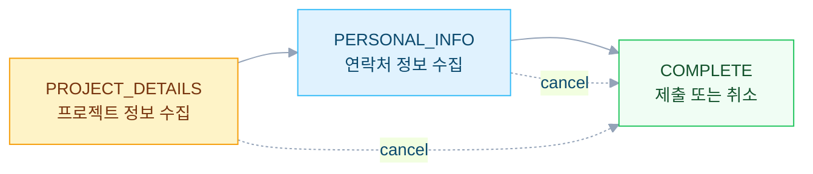

챗봇에서 "가격이 얼마인가요?"라는 질문은 단순한 한 턴 질문이 아니다. 실제 견적을 만들려면 프로젝트 위치, 건물 유형, 면적, 예산, 연락처 등 **여러 턴에 걸쳐 정보를 수집**해야 한다. B2B 챗봇에서 이런 멀티 턴 견적 워크플로우를 상태 머신 패턴으로 설계한 경험을 정리한다.

---

## 문제: 단일 에이전트의 한계

초기에는 견적 관련 질문이 들어오면 단일 에이전트가 모든 것을 처리하려 했다. 프롬프트 하나에 "정보가 부족하면 물어보고 다 모이면 견적서를 생성하라"고 지시했더니 다음과 같은 문제가 발생했다.

1. **질문 순서가 일관되지 않음** — 때로는 위치를 먼저 때로는 예산을 먼저 물어본다
2. **이미 답한 질문을 다시 물어봄** — 컨텍스트가 길어지면 이전 답변을 놓친다
3. **수집 완료 시점 판단 실패** — 정보가 충분한데도 계속 물어보거나 부족한데 견적 생성을 시도한다
4. **단일 프롬프트의 복잡도 한계** — 정보 수집 + 단계 판단 + 응답 생성을 하나의 프롬프트에 넣으니 각 역할의 정확도가 떨어진다

---

## 해결: 상태 머신 + 에이전트 분리

워크플로우를 3개의 상태(State)로 정의하고 각 단계마다 전문 에이전트를 배치했다.

### 상태 정의



| 상태 | 수집 정보 | 완료 조건 |
|---|---|---|
| `PROJECT_DETAILS` | 건물 유형, 면적, 위치, 용도, 예산 | 핵심 3개 이상 수집 |
| `PERSONAL_INFO` | 이름, 이메일, 전화번호, 회사명 | 이름 + 연락처 1개 이상 |
| `COMPLETE` | - | 제출 또는 취소 |

### 에이전트 구성

```
QuotationAgent (Orchestrator — BaseAgent 상속)
  ├── ParserAgent      → 사용자 입력 파싱
  ├── StepRouterAgent  → 현재 단계 판단 (라우터)
  ├── ProjectAgent     → 프로젝트 정보 수집
  ├── ContactAgent     → 연락처 정보 수집 + 데이터 포맷팅
  └── CompleteAgent    → 제출/취소 처리
```

---

## 구현: 3단계 파이프라인

### QuotationAgent (오케스트레이터)

```java
public class QuotationAgent extends BaseAgent {

    @Override
    protected Flowable<Event> runAsyncImpl(InvocationContext ctx) {
        return Flowable.concat(
            // Step 1: 사용자 입력 파싱
            parserAgent.runAsync(ctx),
            // Step 2: 현재 단계 판단
            Flowable.defer(() -> stepRouterAgent.runAsync(ctx)),
            // Step 3: 해당 단계 에이전트 실행
            Flowable.defer(() -> routeToDomainAgent(ctx))
        );
    }

    private Flowable<Event> routeToDomainAgent(InvocationContext ctx) {
        String nextStep = readString(ctx, "current_step_result");
        return switch (Step.valueOf(nextStep)) {
            case PROJECT_DETAILS -> projectAgent.runAsync(ctx);
            case PERSONAL_INFO -> contactAgent.runAsync(ctx);
            case COMPLETE -> completeAgent.runAsync(ctx);
        };
    }

    enum Step {
        PROJECT_DETAILS, PERSONAL_INFO, COMPLETE;
    }
}
```

### 왜 3단계로 분리했는가

단일 에이전트가 입력 파싱, 상태 판단, 응답 생성을 모두 담당하면 각 역할의 정확도가 떨어진다. 3단계로 분리하면 각 에이전트가 하나의 역할에만 집중한다.

```
Parser Agent:   "사용자가 무슨 말을 했는가?" (입력 이해에만 집중)
Router Agent:   "지금 어떤 단계인가?" (상태 판단에만 집중)
Domain Agent:   "무엇을 물어볼까?" (응답 생성에만 집중)
```

---

## 각 에이전트의 역할

### 1. ParserAgent

사용자 입력에서 워크플로우 관련 정보를 구조적으로 추출한다.

```
입력: "200평 사무실인데 냉방만 필요하고 서울이야"

파싱 결과 (State에 저장):
- building_type: "office"
- area: "200평"
- location: "서울"
- usage: "cooling only"
```

한 문장에 여러 정보가 섞여 있어도 각각 분리해서 State에 저장한다. 이후 에이전트들은 State만 보면 된다.

### 2. StepRouterAgent

State에 축적된 정보를 기반으로 **현재 어떤 단계인지** 판단한다. 워크플로우 전체의 흐름을 결정하는 역할이라 정확도가 중요하므로 상위 모델을 사용한다.

```
판단 로직:
- 프로젝트 정보(건물 유형, 면적, 위치) 충분한가?
  → 부족하면 PROJECT_DETAILS
  → 충분하면 PERSONAL_INFO로 전환

- 연락처(이름, 이메일/전화) 충분한가?
  → 부족하면 PERSONAL_INFO
  → 충분하면 COMPLETE로 전환

- 사용자가 "cancel", "stop"을 말했는가?
  → COMPLETE (취소 처리)
```

### 3. ProjectAgent / ContactAgent

각 단계에서 **부족한 정보만 질문**하는 에이전트다.

```
ProjectAgent:
- State에서 이미 수집된 정보 확인
- 아직 모르는 것만 자연스럽게 질문
- "200평 서울 사무실이시군요.
   예산 범위와 냉방 전용인지 냉난방 겸용인지 알려주시겠어요?"

ContactAgent:
- 프로젝트 정보 수집 완료 확인
- 연락처 정보 요청
- 수집 완료 시 데이터를 제출 형식으로 포맷
```

---

## Intent 연속성과의 연동

워크플로우가 진행 중일 때 IntentAgent가 중간에 Intent를 바꿔버리면 워크플로우가 끊긴다.

```
에이전트: "프로젝트 위치가 어디인가요?"
사용자:   "서울"

IntentAgent가 "서울" → DEALER_RECOMMENDATION으로 분류하면?
워크플로우가 중단되고 딜러 추천으로 잘못 전환된다.
```

이를 방지하기 위해 IntentAgent에 **Contextual Override 규칙**을 적용했다.

```
QUOTATION IN PROGRESS:
- 에이전트가 견적 관련 질문을 한 상태에서
- 사용자가 답변하면
- 무조건 QUOTATION_CONSULTATION 유지

전환 조건:
- 사용자가 "cancel", "stop" 명시
- 또는 완전히 다른 주제를 질문
```

---

## 결과

| 지표 | 단일 에이전트 | 상태 머신 |
|---|---|---|
| 견적 완료율 | \~45% | \~78% |
| 평균 수집 턴 수 | 6\~8턴 (중복 질문 포함) | 3\~4턴 |
| 중복 질문 비율 | \~30% | \~5% |
| 수집 완료 판단 정확도 | \~70% | \~92% |

상태 머신 패턴의 핵심은 **"지금 어디에 있는지"를 명확히 아는 것**이다. 각 에이전트가 자신의 역할에만 집중하고 상태 전환은 라우터가 전담하는 구조가 복잡한 멀티 턴 워크플로우에서 효과적이었다.

---

## 참고

- [Google ADK Documentation](https://google.github.io/adk-docs/)
- [State Pattern — Refactoring Guru](https://refactoring.guru/design-patterns/state)

---

### 멀티 에이전트 챗봇 시리즈

- 이전: [Milvus 파티션 기반 Multi-Source RAG 설계](/blog/multi-agent-rag-dual-source)
- 다음: [멀티 에이전트 챗봇의 응답 품질 개선](/blog/multi-agent-feedback-quality-improvement)
