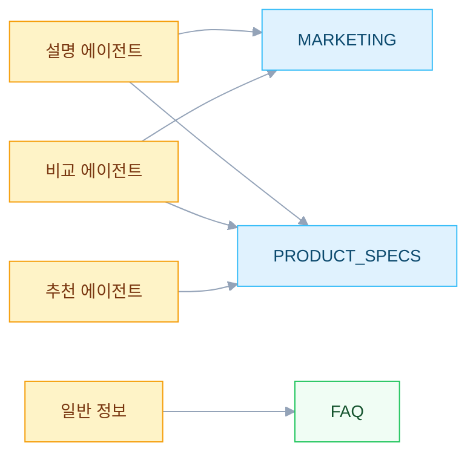

RAG(Retrieval-Augmented Generation)를 구현할 때 단일 벡터 컬렉션에 모든 문서를 넣고 검색하는 방식이 일반적이다. 하지만 실제 B2B 챗봇을 운영하면서 **같은 질문이라도 필요한 정보의 종류가 다르다**는 것을 깨달았다. Milvus 벡터 DB를 파티션으로 나누고 에이전트별로 다른 소스를 조합하여 검색하는 Dual-Source RAG 전략을 정리한다.

---

## 문제: 단일 소스 검색의 한계

초기에는 모든 문서(기술 스펙, 마케팅 자료, FAQ)를 하나의 컬렉션에 넣고 검색했다.

```
질문: "A 제품과 B 제품을 비교해줘"

단일 소스 검색 결과:
- 마케팅 블로그: "A 제품은 호텔에 최적화된 솔루션입니다..." (감성적, 정량 데이터 부족)
- 마케팅 블로그: "B 제품은 쾌적한 냉방을 제공합니다..." (감성적)
- FAQ: "B 제품은 가변 냉매 유량 시스템입니다" (기본 정의)

→ 비교에 필요한 정량 스펙(용량, 효율, 크기)이 누락
```

**마케팅 자료**는 감성적이고 장점 중심이라 비교/추천에 부적합했다. **기술 스펙**은 정량 데이터가 풍부하지만 사용자 친화적 설명이 부족했다. 두 소스의 **강점이 상호보완적**이었다.

---

## 해결: 파티션 기반 분리 전략

Milvus의 파티션 기능을 활용하여 문서를 3개 파티션으로 분리했다.

| 파티션 | 데이터 소스 | 특성 | 주요 사용 에이전트 |
|---|---|---|---|
| `PRODUCT_SPECS` | 제품 기술 사양서 | 정량 데이터(용량, 효율, 크기) | 비교, 추천 |
| `MARKETING` | 블로그, 홍보 자료 | 장점, 사용 사례, 고객 혜택 | 설명, 비교 |
| `FAQ` | FAQ, 정책 문서 | 보증, A/S, 일반 정보 | 일반 정보 |

### 에이전트별 검색 전략



---

## 구현: Dual-Source 검색 워크플로우

### Tool 분리

```java
// 기술 스펙 검색 — PRODUCT_SPECS 파티션
public class ProductSpecsSearchTool {
    public String searchProductSpecs(String query) {
        return milvusClient.search(query, "PRODUCT_SPECS", topK);
    }
}

// 마케팅 콘텐츠 검색 — MARKETING 파티션
public class MarketingSearchTool {
    public String searchMarketing(String query) {
        return milvusClient.search(query, "MARKETING", topK);
    }
}

// FAQ 검색 — FAQ 파티션
public class FaqSearchTool {
    public String searchFaq(String query) {
        return milvusClient.search(query, "FAQ", topK);
    }
}
```

### 에이전트 워크플로우 (5단계)

비교 에이전트를 예로 들면:

```
Step 1: 비교 대상 추출
  → 사용자 메시지에서 제품명/카테고리 식별

Step 2: 기술 스펙 검색 (searchProductSpecs)
  → PRODUCT_SPECS 파티션에서 정량 데이터 조회
  → 용량, 효율, 크기, 무게 등

Step 3: 마케팅 콘텐츠 검색 (searchMarketing)
  → MARKETING 파티션에서 장점, 사용 사례 조회

Step 4: 증거 검증 (Evidence Validation)
  → 두 소스의 결과 품질 확인
  → 한쪽만 있어도 응답 가능하지만 품질 저하 경고

Step 5: 구조화된 응답 생성
  → 기술 스펙(비교 테이블) + 마케팅(장단점 설명) 조합
```

### 프롬프트에서 소스 구분 강조

```
EVIDENCE USAGE RULES:
- Technical specs (from searchProductSpecs): Use for comparison tables, exact numbers
- Marketing content (from searchMarketing): Use for benefits, use cases, recommendations
- NEVER invent data not found in either source
- If only one source available: proceed but note "limited data"
```

---

## Auto-Discovery 모드

"호텔용 냉방 제품 비교해줘"처럼 **구체적 제품명 없이 비교를 요청**하는 경우가 많았다. 초기에는 "어떤 제품을 비교할까요?"라고 되물었지만 사용자 경험이 좋지 않았다.

### Dual-Mode 설계

```
MODE A: 명시적 비교 (사용자가 제품명을 지정)
  "A 제품과 B 제품 비교해줘"
  → 각 제품별로 개별 검색

MODE B: Auto-Discovery (제품명 미지정)
  "호텔용 냉방 제품 비교해줘"
  → 컨텍스트 키워드로 자동 검색 → 카테고리 분류 → 대표 제품 선정
```

### Auto-Discovery 워크플로우

```
1. 컨텍스트 키워드 추출
   "15000㎡ 호텔 냉방 제품 비교해줘"
   → keywords: "냉방", "호텔", "15000㎡"

2. 통합 검색 (topK=10)
   searchProductSpecs("냉방 호텔 15000㎡") → 10개 결과

3. Smart Categorization
   결과를 2~3개 카테고리로 그룹핑:
   - "A 시리즈" (공랭식)
   - "B 시리즈" (수랭식)
   - "C 시리즈" (칠러)

4. 대표 제품 선정
   카테고리별 상위 1개 = 총 3개 제품

5. 비교 응답 생성
   "호텔 냉방 요구사항에 맞는 제품을 검색하여 비교했습니다:
    A 시리즈, B 시리즈, C 시리즈"
```

### 컨텍스트 기반 쿼리 빌딩

```
사용자 조건에 따라 검색 쿼리를 동적으로 구성:

면적 언급 → "[query] for [area]㎡"
용도 언급 → "[query] for [usage]"
가격 언급 → "[query] [affordable/premium/budget]"

예: "15000㎡ 호텔 냉방"
예: "500실 호텔 냉난방"
```

---

## 카테고리 불일치 방지

검색 결과와 사용자 요청의 카테고리가 다른 경우를 처리하는 규칙도 추가했다.

```
사용자: "사무실용 C 타입 제품 추천해줘"
검색 결과: A 타입 제품만 반환됨 (C 타입 데이터 없음)

❌ 잘못된 응답: "사무실에 적합한 A 타입 제품을 추천드립니다!"
   → 사용자는 C 타입을 원했는데 A 타입을 추천

✅ 올바른 응답: "C 타입 제품 중 조건에 맞는 결과를 찾지 못했습니다.
   다만 사무실 냉방에는 A 타입이 많이 사용됩니다.
   A 타입 제품도 함께 살펴보시겠어요?"
```

---

## 증거 검증(Evidence Validation)

LLM이 검색 결과에 없는 정보를 만들어내는 것(hallucination)을 방지하기 위해, 증거 검증 단계를 명시적으로 프롬프트에 포함했다.

```
EVIDENCE VALIDATION (MANDATORY before responding):
1. Check: Do search results contain relevant data?
2. If YES for both sources → Generate comprehensive response
3. If only SPECS available → Proceed with technical focus, note limited marketing data
4. If only MARKETING available → Proceed with benefits focus, note missing specifications
5. If NEITHER source has data → Inform user and suggest alternative queries
6. NEVER invent specifications, prices, or features not in search results
```

---

## Before vs After

### 단일 소스 응답

```
Q: "A 제품과 B 제품 비교해줘"

A: "A 제품은 대형 건물에 최적화된 프리미엄 솔루션입니다.
   뛰어난 에너지 효율과 유연한 설치를 제공합니다.
   B 제품은 비용 효율적인 냉방 솔루션입니다."

→ 감성적 표현만 있고 정량 비교 불가
```

### Dual-Source 응답

```
Q: "A 제품과 B 제품 비교해줘"

A: ## 개요
   A 제품과 B 제품은 모두 가변 냉매 유량 시스템으로...

   ## 기술 사양
   | 항목          | A 제품           | B 제품           |
   |--------------|------------------|------------------|
   | 용량          | 22.4~84kW        | 14~56kW          |
   | EER          | 4.78             | 3.95             |
   | 소음          | 54dB             | 58dB             |

   ## 주요 차이점
   - 에너지 효율: A 제품이 EER 기준 약 21% 높음
   - 용량 범위: A 제품이 더 넓은 범위를 커버

   ## 용도별 추천
   ### A 제품이 적합한 경우:
   - 대형 상업 건물 (500㎡+)
   - 에너지 효율이 최우선인 경우

   ### B 제품이 적합한 경우:
   - 소규모 설치
   - 예산이 제한적인 경우

→ 정량 스펙(PRODUCT_SPECS) + 사용 사례(MARKETING) 조합
```

---

## 교훈

### 1. 파티션 분리는 검색 품질과 비용 모두 개선한다

전체 컬렉션 검색 대비 파티션 검색은 **검색 범위가 좁아져 정확도가 높아지고** 불필요한 결과가 줄어 **토큰 사용량도 감소**했다.

### 2. topK 값은 에이전트별로 다르게 설정해야 한다

- 추천 에이전트: `topK=5` (소수의 정확한 결과)
- Auto-Discovery: `topK=10` (다양한 카테고리 발견)
- FAQ: `topK=3` (정확한 답변 하나면 충분)

### 3. 두 소스의 결합 순서가 중요하다

비교 에이전트에서는 `PRODUCT_SPECS → MARKETING` 순서가 효과적이었다. 정량 데이터로 뼈대를 세우고 마케팅 콘텐츠로 살을 붙이는 구조다. 반대로 설명 에이전트에서는 `MARKETING → PRODUCT_SPECS` 순서가 더 자연스러운 글을 만들었다.

---

## 참고

- [Milvus Partition Documentation](https://milvus.io/docs/manage-partitions.md)

---

### 멀티 에이전트 챗봇 시리즈

- 이전: [멀티 에이전트 챗봇의 SSE 스트리밍 아키텍처](/blog/multi-agent-sse-streaming-webflux)
- 다음: [멀티 턴 워크플로우를 상태 머신으로 설계하기](/blog/multi-agent-quotation-state-machine)
