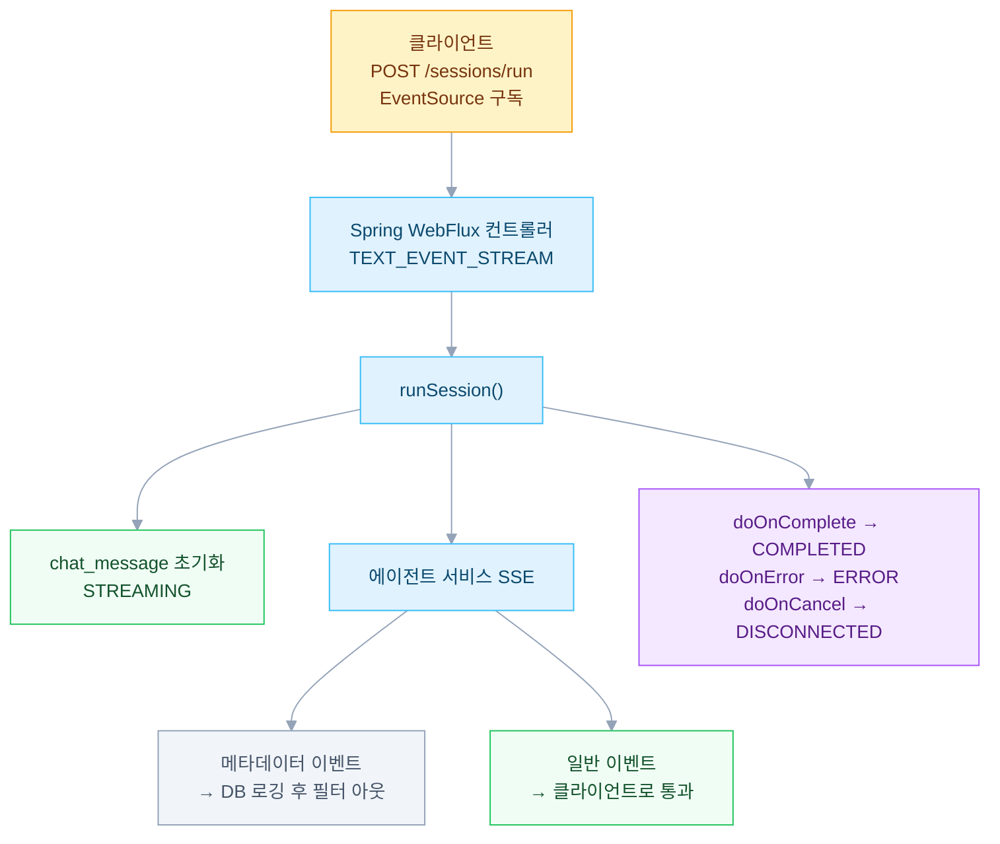

멀티 에이전트 챗봇에서 여러 에이전트가 동시에 응답을 생성할 때 이를 실시간으로 클라이언트에 전달하는 구조가 필요하다. Spring WebFlux + SSE 기반의 스트리밍 아키텍처를 설계하면서 메타데이터 필터링과 완료 상태 추적 패턴을 정리한다.

---

## 문제 정의

멀티 에이전트 챗봇 시스템에서 사용자가 메시지를 보내면 5\~10개의 에이전트가 동시에 응답을 생성한다. 핵심 과제는 다음과 같다.

- **실시간 전달**: 모든 응답을 기다리지 말고 각 에이전트 응답이 나오는 즉시 클라이언트에 전달
- **메타데이터 필터링**: 토큰 수, 모델 정보 같은 메타데이터는 DB에 로깅하되 프론트엔드로는 보내면 안됨
- **완료 상태 추적**: 정상 완료(COMPLETED), 오류(ERROR), 클라이언트 연결 해제(DISCONNECTED) 구분
- **논블로킹 사이드 이펙트**: DB 저장, 외부 시스템 동기화 같은 작업이 메인 스트림을 막으면 안됨

## WebFlux + SSE 선택 이유

### WebFlux가 필요한 이유
- **동시 연결**: 서버당 수천 개의 SSE 연결 처리 (WebMvc는 스레드 풀 고갈)
- **논블로킹 I/O**: R2DBC를 통한 데이터베이스 접근이 자연스러움
- **Flux/Mono 모델**: 스트리밍 응답 패턴이 언어 수준에서 지원됨
- **백프레셔**: 느린 클라이언트에 대한 자동 조절

### SSE가 WebSocket보다 나은 이유
- **단방향**: 서버→클라이언트만 필요 (사용자 메시지는 REST POST로 별도 전송)
- **자동 재연결**: 브라우저 EventSource API가 기본 지원
- **프록시 투과성**: HTTP 기반이라 CDN, 프록시 통과 가능
- **구현 단순성**: WebSocket 핸드셰이크 없음

## 아키텍처



## 구현

### 컨트롤러

```java
@PostMapping(value = "/run", produces = MediaType.TEXT_EVENT_STREAM_VALUE)
public Flux<ChatMessage> runSession(@RequestBody RunSessionRequest request) {
    return aiAgentService.runSession(request);
}
```

### 서비스 - 핵심 스트리밍 로직

```java
public Flux<ChatMessage> runSession(RunAgentSessionRequest request) {
    // 1. messageId 생성 (모든 응답을 그룹화)
    String messageId = UUID.randomUUID().toString();

    // 2. STREAMING 상태로 chat_message 초기화
    return chatMessageService.initializeChatMessage(
            request.getSessionId(), messageId, "STREAMING")
        // 3. Mono를 Flux로 체이닝
        .thenMany(
            aiAgentPort.runSession(request)
                // 4. 각 메시지에 messageId 주입
                .map(message -> {
                    message.setMessageId(messageId);
                    return message;
                })
                // 5. 메타데이터 필터링 (side-effect 포함)
                .flatMap(message -> {
                    if (message.getChatLogMetadata() != null) {
                        // 메타데이터: 토큰 수, 모델 정보 로깅 후 필터
                        return aiChatLogService
                            .recordChatLogFromMetadata(
                                message.getChatLogMetadata(),
                                message)
                            .then(Mono.empty());
                    }
                    // 일반 메시지: 클라이언트로 전송
                    return Mono.just(message);
                })
        )
        // 6. 스트림 완료/오류/취소 추적
        .doOnComplete(() ->
            completeChatMessageAsync(messageId, "COMPLETED", null))
        .doOnError(error ->
            completeChatMessageAsync(messageId, "ERROR", error.getMessage()))
        .doOnCancel(() ->
            completeChatMessageAsync(messageId, "DISCONNECTED", null));
}
```

### 이벤트 필터링 패턴

flatMap을 filter 대신 사용하는 이유는 필터링하기 전에 side-effect(로깅)를 수행해야 하기 때문이다.

```java
.flatMap(message -> {
    if (message.getChatLogMetadata() != null) {
        // 메타데이터를 로깅한 후 스트림에서 제거
        return aiChatLogService.recordChatLogFromMetadata(metadata, message)
            .then(Mono.empty());
    }
    return Mono.just(message);
})
```

### Fire-and-Forget 패턴

```java
private void completeChatMessageAsync(
        String messageId,
        String status,
        String errorMessage) {
    chatMessageService
        .completeChatMessage(messageId, status, errorMessage)
        // boundedElastic 스케줄러로 이벤트 루프 차단 방지
        .subscribeOn(Schedulers.boundedElastic())
        .subscribe(
            saved -> log.info("ChatMessage completed: {}", status),
            error -> log.error("Failed to complete ChatMessage", error)
        );
}
```

Fire-and-Forget이 필요한 이유는 다음과 같다.

- `doOnComplete/doOnError/doOnCancel`은 터미널 오퍼레이터다. (반환값 없음)
- 스트림 완료를 클라이언트에게 먼저 알린다.
- DB 저장이 클라이언트 응답을 지연시키면 안 된다.
- `boundedElastic` 스케줄러로 스레드 풀을 사용한다.

### 완료 상태

| 상태 | 트리거 | 의미 |
|---|---|---|
| COMPLETED | Flux.onComplete() | 모든 에이전트 완료 |
| ERROR | Flux.onError() | 에이전트 또는 시스템 오류 |
| DISCONNECTED | Flux.doOnCancel() | 클라이언트가 연결 종료 |

## 음성 통합 (3가지 모드)

### 모드 1: 동기식 음성
```
AudioFile → STT → runSession() → collectList() → VoiceSessionResult
```
모든 응답을 기다린다. 단순하지만 느리다.

### 모드 2: 스트림 음성
```
AudioFile → STT → Flux.concat(transcriptionMessage, runSession())
```
실시간 스트리밍이다. 첫 번째 이벤트는 음성 인식 결과이고 그 다음이 에이전트 응답이다.

### 모드 3: Realtime WebSocket
```
브라우저 마이크 → WebSocket → Realtime STT API → Transcript → runSession()
```
가장 반응성이 좋다. 양방향 오디오 스트리밍을 지원한다.

### 모드 비교

| 모드 | 지연시간 | 복잡도 | 사용 사례 |
|---|---|---|---|
| 동기식 | 높음 | 낮음 | 간단한 통합 |
| 스트림 | 중간 | 중간 | 웹 앱 (권장) |
| Realtime | 낮음 | 높음 | 음성 우선 경험 |

## Port/Adapter 패턴

```java
// Port (인터페이스)
public interface AiAgentPort {
    Mono<Session> createSession(CreateSessionCommand command);
    Flux<ChatMessage> runSession(RunAgentSessionCommand command);
}

// Adapter (WebClient 구현)
public class AiAgentClient implements AiAgentPort {
    // 외부 AI 에이전트 서비스로의 WebClient SSE 연결
}
```

장점은 다음과 같다.

- 테스트 가능하다. (port mock 처리)
- 교체 가능하다. (AI 제공자 변경)
- 격리되어 있다. (timeout/retry는 adapter에만)

## 주의사항

1. **SSE 타임아웃**: 응답 타임아웃을 65초로 설정한다. 복잡한 쿼리는 30\~60초 소요된다.

2. **R2DBC vs JPA**: WebFlux에서는 JPA 사용이 불가능하다. R2DBC 또는 `subscribeOn(Schedulers.boundedElastic())`으로 블로킹 호출을 감싸야 한다.

3. **이벤트 순서**: 단일 Flux 내에서는 순서가 보장된다. 병렬 에이전트는 인터리빙이 가능하다.

4. **클라이언트 재연결**: 프론트엔드는 네트워크 끊김 시 SSE 재연결 처리가 필요하다.

5. **메모리**: 큰 Flux를 List로 수집하지 말고 직접 스트림으로 처리해야 한다.

---

## 참고

- [Spring WebFlux Reference](https://docs.spring.io/spring-framework/reference/web/webflux.html)
- [Server-Sent Events — MDN](https://developer.mozilla.org/en-US/docs/Web/API/Server-sent_events)

---

### 멀티 에이전트 챗봇 시리즈

- 이전: [LLM 멀티 에이전트 시스템의 Intent 라우팅 설계](/blog/multi-agent-intent-routing)
- 다음: [Milvus 파티션 기반 Multi-Source RAG 설계](/blog/multi-agent-rag-dual-source)
