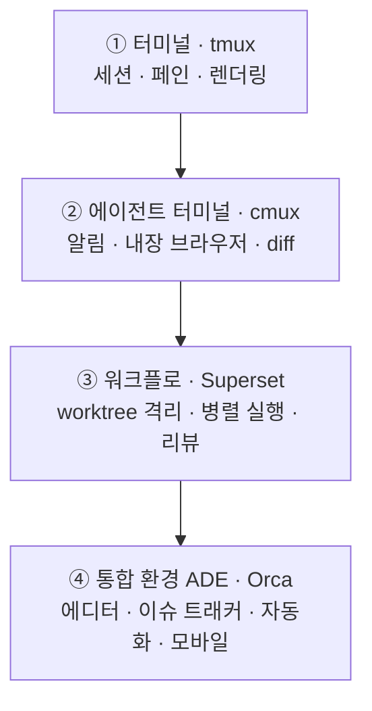

얼마 전까지 코딩 에이전트를 여러 개 굴릴 때 Superset을 썼다. 작업마다 git worktree를 만들어 브랜치를 격리하고, 에이전트가 끝낸 결과를 diff로 비교하는 흐름이 편했다.

에이전트 하나만 쓸 때는 터미널 탭을 몇 개 띄우는 것으로 충분했다. 하지만 하나에는 리팩터링을 맡기고 다른 하나에는 버그를 보게 하거나, 같은 문제를 두 에이전트에게 맡겨 결과를 비교하기 시작하면서 작업 디렉터리와 브랜치를 직접 관리하는 일이 번거로워졌다. Superset은 그 부분을 대신해줬다.

최근에는 Orca로 옮겼다. 처음 실행했을 때는 Superset과 UI 구조가 비슷해서 낯설지 않았다. 사이드바에 worktree가 쌓이고, 각 작업에서 에이전트를 실행하고, 여러 작업을 나란히 보는 흐름도 익숙했다.

며칠 사용해보니 둘의 차이는 worktree 관리보다 그다음 단계에 있었다. Orca에서는 코드 편집과 브라우저 확인, UI 요소를 코드 위치와 연결하는 Design Mode, 모바일 시뮬레이터 제어, 자동화까지 같은 앱 안에서 이어졌다.

그래서 이 글에서는 tmux와 cmux, Superset, Orca를 간단히 비교하고 내가 Superset에서 Orca로 옮긴 이유를 정리해보려고 한다. 모든 기능을 장기간 검증한 비교는 아니다. Superset과 Orca는 직접 사용한 경험을 중심으로 썼고, cmux는 공식 문서에서 확인한 내용을 바탕으로 비교했다.

*Orca는 작업마다 worktree를 만들어 사이드바에 쌓고, 각 에이전트의 상태(작업 중·완료·입력 대기)를 함께 보여준다.*

---

## 같은 종류의 도구는 아니다

tmux와 cmux, Superset, Orca를 한 줄로 세워놓고 어느 것이 가장 좋은지 비교하기는 어렵다. 서로 책임지는 범위가 다르기 때문이다.

나는 편의상 다음과 같이 나눠봤다.

- **tmux**는 터미널 세션과 페인을 관리한다.
- **cmux**는 코딩 에이전트 사용에 필요한 알림과 브라우저를 터미널에 더했다.
- **Superset**은 worktree 격리와 병렬 작업, diff 검토를 중심으로 에이전트 작업 공간을 관리한다.
- **Orca**는 worktree와 터미널뿐 아니라 편집기, 브라우저, 자동화까지 한 앱에 포함한다.

Orca는 이런 환경을 ADE(Agent Development Environment)라고 부른다. 전통적인 IDE가 사람이 코드를 편집하는 흐름을 중심으로 만들어졌다면, ADE는 여러 에이전트가 작업하고 사람이 그 결과를 감독하는 흐름에 더 가깝다.

이 구분은 공식적인 표준이라기보다 네 도구를 비교하기 위해 내가 잡은 기준이다.

*아래로 갈수록 한 앱이 책임지는 범위가 넓어진다. 다만 요즘은 cmux가 diff 뷰어를, Superset이 내장 브라우저를 더하는 식으로 서로 기능이 수렴하고 있어서 이 경계는 점점 흐려지는 중이다.*

---

## tmux: 가장 가볍지만 직접 챙길 것이 많다

tmux는 오래된 터미널 멀티플렉서다. 세션과 윈도우, 페인으로 화면을 나눌 수 있고 SSH 연결이 끊겨도 작업이 유지된다.

각 페인에 Claude Code나 Codex를 실행하면 에이전트 여러 개를 동시에 사용하는 것도 가능하다. 다만 에이전트별 작업 공간은 직접 관리해야 한다.

브랜치 충돌을 피하려면 `git worktree`를 만들고 각 페인을 다른 디렉터리에 연결해야 한다. 작업이 끝나면 `git diff`로 결과를 확인하고 어떤 브랜치를 합칠지도 직접 결정한다. 에이전트가 작업 중인지, 입력을 기다리는지도 페인을 하나씩 확인해야 한다.

무료이고 가볍고 어디서나 사용할 수 있다는 장점은 여전히 크다. 대신 에이전트 수가 늘어날수록 사람이 관리할 일도 함께 늘어난다.

---

## cmux: 에이전트 사용에 맞춘 네이티브 터미널

cmux는 macOS용 네이티브 터미널이다. Swift와 AppKit으로 만들어졌고 터미널 렌더링에는 libghostty를 사용한다.

세로 사이드바에는 git 브랜치와 작업 디렉터리, 실행 중인 포트가 표시된다. 에이전트가 입력을 기다리면 페인에 알림 링이 생기고 사이드바와 macOS 알림으로도 상태를 알려준다. 여러 에이전트를 띄워놓고 다른 작업을 할 때 유용한 기능이다.

내장 브라우저도 있다. 터미널 옆에 브라우저를 열 수 있고 CLI와 소켓 API로 페이지 상태를 읽거나 클릭을 실행할 수 있다.

worktree는 사이드바에 "Project Worktrees" 뷰로 보여주긴 하지만 자동으로 만들어주지는 않는다. 그래서 브랜치는 여전히 git 명령으로 직접 관리해야 한다. 다만 최근 버전에서는 변경사항을 비교하는 diff 뷰어가 추가됐고, 바뀐 라인에 코멘트를 달아 에이전트에게 리뷰 피드백으로 넘기는 것도 된다. 이 계열 도구가 그렇듯 cmux도 기능이 빠르게 붙고 있다.

터미널 자체의 속도와 알림이 중요하고 worktree 관리는 직접 해도 괜찮다면 cmux가 잘 맞는다. 무료 GPL 오픈소스이며 현재 데스크톱 앱은 macOS에서 사용할 수 있다. iOS 컴패니언도 제공한다.

---

## Superset: worktree 격리와 병렬 작업이 중심이다

Superset을 사용한 가장 큰 이유는 에이전트마다 git worktree를 자동으로 만들어준다는 점이었다.

새 작업을 만들면 별도 브랜치와 디렉터리가 생긴다. 각 에이전트는 서로 다른 worktree에서 작업하므로 동시에 같은 파일을 수정해도 작업 중간에 서로 영향을 주지 않는다. 작업이 끝나면 변경사항을 diff로 확인하고 필요한 결과만 반영할 수 있다.

Claude Code와 Codex를 비롯한 CLI 에이전트를 붙일 수 있고, 작업 공간별 터미널도 유지된다. VS Code와 Cursor, JetBrains, Xcode 같은 외부 에디터로 worktree를 바로 여는 흐름도 지원한다.

내장 브라우저로 실행 결과를 앱 안에서 바로 확인하는 것도 가능하다.

그래도 제품의 중심은 분명하다. 여러 에이전트에게 작업을 나누고, 각 작업을 격리하고, 결과를 비교하는 흐름이다. 이미 사용하는 에디터가 있고 병렬 작업과 리뷰만 정리하고 싶다면 여전히 깔끔한 선택이다.

---

## Orca에서 달라진 점

Orca도 기본 구조는 비슷하다. 작업마다 git worktree를 만들고 그 안에 에이전트 터미널과 브라우저를 연결한다.

내 작업에서 차이가 크게 느껴졌던 부분은 그 뒤였다.

### 코드 편집과 diff 검토

Orca에는 Monaco 기반 코드 편집기가 들어 있다. 파일 탐색기에서 파일을 열어 바로 수정할 수 있고 변경사항은 자동으로 저장된다. 에이전트가 수정한 diff를 확인하고 라인에 의견을 남겨 다시 전달하는 흐름도 앱 안에서 이어진다.

*에이전트가 만든 diff를 확인하고 바뀐 라인에 의견을 남겨 다시 전달할 수 있다.*

### worktree별 브라우저와 Design Mode

각 worktree에는 별도의 Chromium 브라우저가 붙는다. 주소와 히스토리, 개발자 도구가 있고 작업을 전환하면 해당 worktree에서 보던 탭과 위치도 함께 복원된다.

가장 자주 사용한 기능은 Design Mode였다. 브라우저에서 UI 요소를 선택하면 다음 정보가 에이전트에게 전달된다.

- 선택한 요소의 HTML
- 계산된 CSS
- 해당 영역의 스크린샷
- 소스맵이 있을 때 소스 파일과 라인

화면을 보면서 요소를 설명하고 에이전트가 다시 소스 위치를 찾게 하는 과정이 줄었다. UI를 클릭하고 수정 요청을 보낸 뒤 핫리로드된 결과를 다시 확인하는 흐름이 짧아졌다.

*각 worktree에는 별도의 브라우저가 붙고, Design Mode에서는 화면의 UI 요소를 코드 위치와 연결해 에이전트에게 넘긴다.*

### CLI와 오케스트레이션

Orca는 앱 기능을 CLI로도 열어둔다. 직접 확인해본 범위에서는 worktree 생성과 삭제, 터미널 명령 실행, 출력 확인까지 CLI로 처리할 수 있었다.

*worktree 생성부터 터미널 제어까지 orca CLI로 스크립트화할 수 있다.*

오케스트레이션 기능을 사용하면 코디네이터 에이전트가 작업을 여러 워커에게 나눠줄 수 있다. 워커는 완료나 에스컬레이션, 의사결정이 필요한 상태를 메시지로 보고한다. 단순히 터미널 여러 개를 띄우는 것보다 작업의 시작과 완료 상태를 분명하게 추적하는 방식이다.

CLI에서는 내장 브라우저와 iOS Simulator도 제어할 수 있다. 브라우저 요소를 읽고 클릭하거나 입력할 수 있고, 시뮬레이터에서는 탭과 제스처, 회전 같은 동작을 실행할 수 있다.

네이티브 데스크톱 앱을 조작하는 computer use 기능도 있다. 접근성 트리와 스크린샷을 읽고 다른 앱의 버튼을 누르거나 값을 입력한다. 다만 이 기능은 아직 Beta로 표시돼 있어 안정된 핵심 기능과는 구분해서 보는 편이 좋다.

### 자동화와 Hermes 연동

Orca에는 예약 자동화 기능도 있다. 정해진 시간에 프롬프트를 실행하거나 사전 조건을 확인한 뒤 작업을 시작하도록 구성할 수 있다. 앱을 띄우지 않는 환경에서는 `orca serve`를 런타임으로 사용할 수 있다.

내 환경에서는 예상하지 못한 연동도 하나 발견했다. 이전에 개인 하네스의 오케스트레이터로 설치한 Hermes Agent의 cron 작업이 Orca 자동화 화면에 외부 자동화로 나타났다.

확인해보니 Orca가 Hermes의 `~/.hermes/cron/jobs.json`을 읽고 있었다. Orca에서 해당 작업을 편집하거나 활성화 상태를 바꾸면 Hermes가 사용하는 파일에도 반영됐다. 별도의 복사본을 가져오는 게 아니라 두 도구가 같은 자동화 상태를 공유하는 구조였다.

이 부분은 내 로컬 환경에서 직접 확인한 동작이다. 앞으로 통합 방식이나 파일 구조가 바뀔 가능성은 있다.

### 원격 환경과 모바일

Orca는 macOS뿐 아니라 Windows와 Linux도 지원한다. SSH worktree를 사용하거나 원격 머신에서 `orca serve`를 실행한 뒤 로컬 앱을 클라이언트로 연결할 수도 있다.

*SSH worktree로 원격 머신에서 에이전트를 실행하고 로컬 앱을 클라이언트로 붙인다.*

모바일 컴패니언 앱은 iOS와 Android를 지원한다. 휴대전화에서 에이전트 상태와 최근 터미널 출력을 보고, 입력을 기다리는 에이전트에게 답하거나 계정을 바꿀 수 있다. 다만 모바일 앱은 현재 Beta이며 데스크톱을 대신하는 편집기보다 원격 제어 화면에 가깝다.

---

## 내 작업에서는 왜 Orca가 더 잘 맞았나

처음에는 Orca를 Superset의 상위호환이라고 생각했다. UI가 비슷한데 기능이 더 많아 보였기 때문이다.

지금은 표현을 조금 다르게 하는 편이 정확하다고 생각한다. 모든 사용자에게 Orca가 Superset보다 낫다기보다, 내가 하던 작업의 범위를 Orca가 더 많이 받아줬다.

Superset에서도 worktree 격리와 병렬 에이전트 실행, diff 검토는 충분히 편했다. 하지만 작업을 이어가다 보면 코드를 직접 보고, 브라우저에서 결과를 확인하고, 이슈를 열고, 반복 작업을 자동화해야 했다. 그때마다 외부 도구를 오가는 일이 생겼다.

Orca에서는 그 흐름이 같은 앱 안에서 이어졌다. 특히 세 가지가 옮기는 데 크게 작용했다.

1. worktree마다 브라우저 상태가 따로 유지된다.
2. Design Mode로 화면 요소를 코드 위치와 바로 연결할 수 있다.
3. CLI로 worktree와 터미널, 브라우저를 함께 조작할 수 있다.

모바일 앱을 개발할 때 iOS Simulator를 worktree와 연결해 제어할 수 있다는 점도 컸다.

Superset에서 익힌 작업 방식은 거의 그대로 유지됐다. 새로운 방식을 다시 배우기보다 기존 흐름에 편집기와 브라우저, 자동화가 추가된 느낌에 가까웠다. 그래서 내 작업에서는 Orca가 더 잘 맞았다.

---

## 네 도구를 다시 비교하면

| 항목 | tmux | cmux | Superset | Orca |
|---|---|---|---|---|
| 중심 역할 | 터미널 멀티플렉서 | 에이전트 사용에 맞춘 터미널 | 병렬 에이전트 작업 공간 | 통합 Agent Development Environment |
| 데스크톱 플랫폼 | 크로스 플랫폼 | macOS | macOS | macOS·Windows·Linux |
| worktree 격리 | 직접 구성 | 직접 구성 | 자동 | 자동 |
| 병렬 에이전트 | 페인으로 실행 | 탭·페인으로 실행 | 여러 worktree에서 실행 | 여러 worktree와 페인에서 실행 |
| diff 검토 | git 명령 사용 | 내장, 코멘트 지원 | 내장 | 내장, 라인 주석 지원 |
| 파일 편집 | 없음 | 없음 | 지원 | Monaco 편집기 |
| 내장 브라우저 | 없음 | 있음 | 있음 | worktree별 Chromium |
| 화면 요소와 코드 연결 | 없음 | 없음 | 없음 | Design Mode |
| 데스크톱 앱 제어 | 없음 | 없음 | 없음 | computer use, Beta |
| 이슈 연동 | 없음 | 없음 | Linear | GitHub·Linear·Jira |
| 예약 자동화 | 직접 구성 | 없음 | 없음 | 지원 |
| 원격 실행 | SSH 세션 | SSH | 포트 포워딩 | SSH worktree·Remote Server |
| 모바일 | 없음 | iOS 컴패니언 | 없음 | iOS·Android 컴패니언, Beta |
| 라이선스 | 무료 오픈소스 | 무료 GPL 오픈소스 | ELv2 | 무료 MIT 오픈소스 |

결국 한 앱이 책임지는 범위가 넓을수록 설정과 앱 전환은 줄어든다. 대신 프로그램이 무거워지고 기능을 익히는 데 시간이 든다.

---

## 아직 걸리는 부분

며칠 사용한 경험만으로 완성도를 단정하기는 어렵다. 지금까지 걸렸던 부분은 세 가지다.

### 가볍지는 않다

Orca를 켜둔 상태에서 여러 에이전트와 브라우저를 함께 실행하면 프로세스와 메모리 사용량이 늘어난다. 다른 에이전트 도구까지 동시에 띄웠을 때 시스템 전체가 느려진 적도 있었다.

원인을 전부 Orca로 돌릴 수는 없지만 네이티브 터미널인 cmux와 비교하면 가볍다고 하기는 어렵다. 편집기와 브라우저, 자동화를 한 앱에 넣은 만큼 감수해야 하는 부분으로 보인다.

### 자동화에는 실행 중인 런타임이 필요하다

Orca 예약 자동화는 Orca 앱이나 `orca serve` 런타임이 실행 중이어야 한다. launchd 데몬으로 상시 실행하는 Hermes와는 운영 방식이 다르다.

개발 작업과 연결된 자동화에는 Orca가 편하지만, 운영체제 백그라운드에서 항상 실행돼야 하는 작업이라면 별도 데몬이 더 잘 맞을 수 있다.

### 기능 변화가 빠르다

Orca는 기능이 빠르게 추가되는 도구다. 공식 문서가 있지만 일부 세부 동작은 직접 실행해봐야 알 수 있었다. Experimental이나 Beta로 표시된 기능도 있으므로 핵심 작업에 사용하기 전에는 현재 버전에서 다시 확인하는 편이 안전하다.

이 글의 기능과 비교 내용도 2026년 7월 기준의 스냅샷으로 보는 게 맞다.

---

## 지금은 Orca를 쓰고 있다

tmux는 가장 가볍고 통제할 수 있는 범위가 넓다. cmux는 터미널의 속도와 에이전트 알림에 강점이 있다. Superset은 worktree 격리와 여러 에이전트의 결과를 검토하는 흐름이 잘 잡혀 있다.

Orca는 그보다 더 많은 작업을 한 앱 안으로 가져온다. 모든 사람에게 필요한 범위는 아닐 수 있다. 이미 익숙한 에디터와 브라우저 조합이 있다면 Superset이나 cmux가 더 단순할 수도 있다.

나는 에이전트를 여러 worktree에 나눠 실행한 뒤 코드와 화면을 확인하고, 결과를 비교하고, 반복 작업까지 연결하는 흐름을 자주 쓴다. 지금은 그 과정을 한곳에서 이어갈 수 있다는 점 때문에 Orca를 사용하고 있다.

앞으로도 계속 Orca를 쓸지는 아직 모르겠다. 이 분야의 도구는 빠르게 바뀌고 Superset과 cmux에도 기능이 계속 추가되고 있다. 다만 현재 내 작업 방식에는 Orca가 가장 잘 맞는다.

---

## 참고

- [Orca 공식 문서](https://www.onorca.dev/docs)
- [Orca Design Mode](https://www.onorca.dev/docs/browser/design-mode)
- [Orca CLI](https://www.onorca.dev/docs/cli/reference)
- [Orca 모바일 컴패니언](https://www.onorca.dev/docs/mobile)
- [Superset 공식 문서](https://docs.superset.sh/overview)
- [cmux 공식 사이트](https://cmux.com/)
