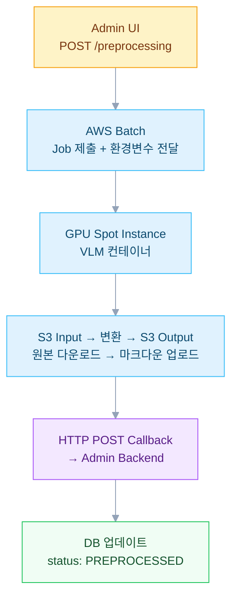
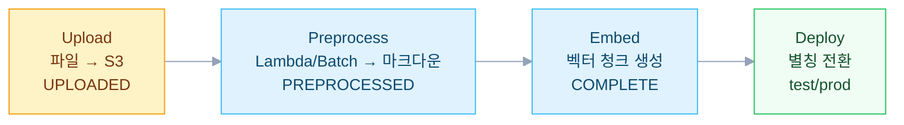

RAG 챗봇을 구축할 때 문서 전처리는 검색 품질을 좌우한다. 단순 텍스트 PDF는 몇 초면 처리되지만 테이블과 이미지가 포함된 마케팅 자료는 GPU가 필요하고 수십 분이 걸린다. 이 처리 시간 편차를 AWS Batch + GPU Spot Instance로 해결한 비동기 파이프라인 설계를 정리한다.

## 문제 정의

RAG 시스템에서 처리해야 할 문서는 두 종류로 나뉜다.

- **단순 문서**: 제품 사양서, FAQ (PDF/XLSX) → Lambda로 5\~30초 처리 가능
- **복잡 문서**: 마케팅 자료, 테이블/이미지 포함 PDF → GPU 필요 (VLM 기반 추출)

Lambda는 5\~30초, Batch+GPU는 1\~60분이다. 처리 시간 편차가 크고 각 문서의 전처리 상태를 추적해야 하는 것도 과제였다.

## 솔루션: 카테고리별 파이프라인 선택

DB의 `pipeline_config`에 카테고리별 처리 전략을 저장한다.

```java
public enum PreprocessType {
    LAMBDA,  // 단순 문서
    BATCH    // 복잡 문서 (GPU 필요)
}
```

| 카테고리 | 타입 | 프로세서 | 소요시간 | 비용 |
|---|---|---|---|---|
| product_specs | LAMBDA | Lambda 함수 | 5-30초 | \~$0.001/문서 |
| faq | LAMBDA | Lambda 함수 | 5-30초 | \~$0.001/문서 |
| marketing | BATCH | AWS Batch + GPU Spot | 1-60분 | \~$0.05/문서 |

파이프라인 엔드포인트는 DB에 저장되며 하드코딩하지 않는다.

```sql
pipeline_config:
  preprocess_type: BATCH
  preprocess_endpoint: /preprocessing/marketing
  embedding_endpoint: /embedding/create
  supported_extensions: ["pdf", "docx", "xlsx", "pptx"]
  max_collections: 5
  delete_after_days: 60
```

## AWS Batch + GPU 아키텍처

### 시퀀스 흐름



### 환경변수 매핑

API 요청 필드를 컨테이너 환경변수로 전달한다는 뜻이다.

| API 필드 | 환경변수 | 설명 |
|---|---|---|
| versionId | VERSION_ID | 버전 식별자 |
| documentId | DOCUMENT_ID | 문서 식별자 |
| fileS3Url | INPUT_BUCKET + INPUT_KEY | 입력 파일 위치 |
| callbackUrl | CALLBACK_URL | 완료 알림 URL |

환경변수를 선택한 이유는 **컨테이너 격리**다. GPU 컨테이너가 Admin API의 스키마를 알 필요가 없다.

### S3 경로 규칙

```
Input:  s3://{input-bucket}/{categoryName}/v{version}/{uuid}.{ext}
Output: s3://{output-bucket}/{categoryName}/v{version}/{uuid}.md

예시:
Input:  s3://doc-input/FAQ/v1/abc-123.xlsx
Output: s3://doc-output/FAQ/v1/abc-123.md
```

## Callback 패턴

### 성공 응답

```json
POST http://admin/api/v1/callback/preprocess
{
  "versionId": "ver-001",
  "documentId": "doc-001",
  "status": "SUCCESS",
  "textS3Url": "s3://output-bucket/FAQ/v1/uuid.md",
  "errorMessage": null,
  "processedAt": "2026-01-30T02:35:34Z"
}
```

### 실패 응답

```json
{
  "versionId": "ver-001",
  "documentId": "doc-001",
  "status": "FAILED",
  "textS3Url": null,
  "errorMessage": "Timeout after 3600s",
  "processedAt": "2026-01-30T02:35:34Z"
}
```

### Polling 대신 Callback을 선택한 이유

1. **API 호출 절감**: 폴링처럼 N초마다 호출하지 않는다.
2. **즉시 알림**: 폴링 간격 지연이 없다.
3. **무상태 처리**: GPU 컨테이너가 연결 유지를 할 필요가 없다.
4. **타임아웃 처리**: 3600초 제한이 있고 GPU는 타임아웃을 FAILED로 보고한다.

## 전체 파이프라인

### 업로드 → 전처리 → 임베딩 → 배포



### Embedding 적용 로직

관리자가 "임베딩 적용"을 클릭할 시 다음을 수행한다.

1. 모든 비완료 문서 조회
2. 삭제 표시된 문서: Milvus 청크 + S3 + DB 삭제
3. UPLOADED 문서: 전처리 먼저 트리거
4. PREPROCESSED 문서: 임베딩 서비스로 전송
5. 수정된 문서: 기존 청크 삭제 후 새 청크 삽입

## GPU Spot Instance 전략

- 비용을 60\~91% 절감한다.
- VLM 기반 문서 변환은 GPU가 필수다 (테이블/이미지 추출용).
- Spot 중단 시 AWS Batch가 자동으로 다른 인스턴스에서 재시도한다.
- 최대 재시도 3회. 타임아웃은 문서당 3600초다.

## 운영 시 주의할 점

1. **DB에 파이프라인 설정 저장**: 새 카테고리 추가 = DB 입력이면 충분하다. 코드 배포는 불필요하다.
2. **Callback 검증**: 업데이트 전 versionId + documentId 일치를 확인한다.
3. **멱등성**: 같은 callback이 두 번 도착해도 불일치가 없어야 한다.
4. **오류 세분화**: "Timeout after 3600s"가 일반적 "FAILED"보다 유용하다.
5. **S3 경로 규칙**: Category/version/uuid 패턴으로 충돌을 방지하고 정리를 용이하게 한다.

---

## 참고

- [AWS Batch Documentation](https://docs.aws.amazon.com/batch/)
- [Milvus Documentation](https://milvus.io/docs/)
