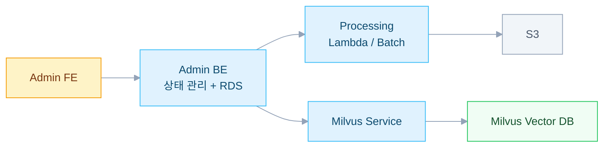
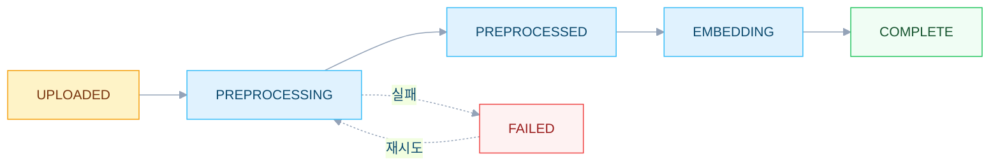

RAG 챗봇의 지식은 계속 바뀐다. 제품 사양서가 업데이트되고 FAQ가 추가되고 마케팅 자료가 교체된다. 벡터 DB에 단순히 덮어쓰면 롤백이 불가능하고 테스트 없이 프로덕션에 반영된다. Milvus의 컬렉션 버저닝과 Alias를 활용해서 블루-그린 배포가 가능한 지식 관리 시스템을 설계한 경험을 정리한다.

---

## 문제 정의

벡터 DB에서 문서를 관리할 때 두 가지 과제가 있었다.

- **롤백**: 잘못된 임베딩이 배포되면 즉시 이전 버전으로 돌릴 수 있어야 한다
- **단계 추적**: 문서는 업로드 → 전처리(PDF/XLSX → Markdown) → 임베딩 → 완료까지 각 단계를 추적해야 한다

## 아키텍처 개요



카테고리는 동적이며 각각 고유한 파이프라인 설정을 가진다.

## 핵심 개념

### 4단계 배포 상태

배포 가능 여부를 한눈에 판단할 수 있도록 설계했다.

| 상태 | 아이콘 | 조건 | 설명 |
|---|---|---|---|
| READY | ✅ | 컬렉션 존재 + 모든 문서 COMPLETE | 배포 가능 |
| PENDING_CHANGES | 🔶 | 컬렉션 존재 + 미완료 문서 있음 | 배포 가능하나 최신 아님 |
| PROCESSING | 🔄 | PREPROCESSING 또는 EMBEDDING 상태 문서 | 진행 중 |
| EMBEDDING_REQUIRED | ⚠️ | 컬렉션 없음 | 배포 불가 |

### 문서 상태 머신



마크다운 직접 편집은 PREPROCESSED 상태로 건너뛴다.

### 이중 상태 추적 (change_type + status)

| change_type | status | 의미 |
|---|---|---|
| ADDED | UPLOADED | 신규 파일 업로드 |
| ADDED | COMPLETE | 신규 파일 임베딩 완료 |
| MODIFIED | PREPROCESSED | 마크다운 편집 |
| MODIFIED | COMPLETE | 편집 임베딩 완료 |
| UNCHANGED | COMPLETE | 변경 없음 |

## 버전 관리 — 스냅샷 기반

### 새 버전 생성

- base_version에서 복사한다 (스냅샷).
- 복사 대상: 문서 메타데이터와 마크다운 파일. S3 경로는 새로 생성한다.
- 복사하지 않는 것: Milvus 컬렉션, 임베딩 결과, 삭제된 문서
- 새 버전은 PREPROCESSED 상태로 시작한다. 임베딩이 필요하다.

### 문서 삭제 전략

청크 존재 여부에 따라 동작이 다르다.

- status ≠ COMPLETE → Milvus에 청크가 없으므로 즉시 삭제한다 (S3 + DB).
- status = COMPLETE → 삭제 표시만 해두고 다음 임베딩 적용 시 실제로 삭제한다.

### 문서 편집 잠금

- 프로덕션 배포 전: 편집 허용. 테스트 중에도 수정 가능하다.
- 프로덕션 배포 후: 편집 금지. 새 버전을 생성해야 한다.

## Milvus 컬렉션 전략

### 버전별 컬렉션

```
카테고리: FAQ
├── faq_v1 (❌ 삭제)
├── faq_v2
├── faq_v3 ← faq_prod (alias)
├── faq_v4
└── faq_v5 ← faq_test (alias)
```

### Alias 기반 블루-그린 배포

| Alias | 용도 | 예시 |
|---|---|---|
| {category}_test | 테스트 서버 | faq_test → faq_v5 |
| {category}_prod | 프로덕션 서버 | faq_prod → faq_v3 |

서버 적용은 Alias 전환만 수행한다. 무중단 배포가 가능하다.

### 컬렉션 정리 정책

- max_collections로 최대 컬렉션 수를 제한한다.
- delete_after_days로 보존 기간을 설정한다.
- 활성 test/prod alias가 있는 컬렉션은 삭제할 수 없다.
- 삭제 시 milvus_collection_id를 null로 바꾸고 문서 상태를 PREPROCESSED로 변경한다.

## 부분 업데이트 지원

Milvus는 document_id 기반 청크 작업을 지원한다.

```python
# 특정 문서의 청크 삭제
client.delete(collection_name="faq_v5", filter="document_id == 'doc-001'")
# 새 청크 삽입
client.insert(collection_name="faq_v5", data=[...새 청크...])
```

빈번한 삭제는 성능 저하를 야기한다. Milvus는 soft-delete 후 컴팩션이 필요하기 때문이다. 대량 변경 시에는 부분 업데이트보다 새 버전을 생성하는 게 낫다.

## DB 스키마 (4개 테이블)

- **category**: 동적 카테고리, pipeline_config (1:1)
- **pipeline_config**: preprocess_type (LAMBDA/BATCH), 엔드포인트, 지원 확장자, max_collections, delete_after_days
- **deployment_version**: 버전 추적, test_active/prod_active 플래그, base_version 자기참조
- **version_document**: 문서 라이프사이클, status, change_type, is_marked_for_deletion, 파일/텍스트 S3 URL

## 배포 상태 계산 로직

```java
public DeployStatus getDeployStatus(DeploymentVersion version) {
    if (processingCount > 0) return PROCESSING;
    if (version.getMilvusCollectionId() == null) return EMBEDDING_REQUIRED;
    if (pendingCount > 0) return PENDING_CHANGES;
    return READY;
}
```

## 핵심 설계 결정

**1. 버전별 컬렉션을 사용하는 이유**

제자리 업데이트 대신 새 컬렉션을 생성한다. 롤백 능력과 격리를 보장한다.

**2. 컬렉션 교체 대신 Alias 전환**

무중단 배포를 실현하고 즉시 전환이 가능하다.

**3. 스냅샷 기반 버저닝**

전처리된 마크다운을 재사용한다. 불필요한 재전처리를 제거한다.

**4. COMPLETE 문서 지연 삭제**

Milvus 청크를 임베딩 적용 없이 삭제할 수 없다.

**5. DB에 동적 파이프라인 설정**

카테고리별로 다른 전처리가 필요하다. 구조화 데이터는 Lambda로 처리하고 마케팅 PDF는 Batch+GPU로 처리한다.

---

## 참고

- [Milvus Collection Alias](https://milvus.io/docs/manage-aliases.md)
- [Milvus Partition & Collection Management](https://milvus.io/docs/manage-collections.md)
