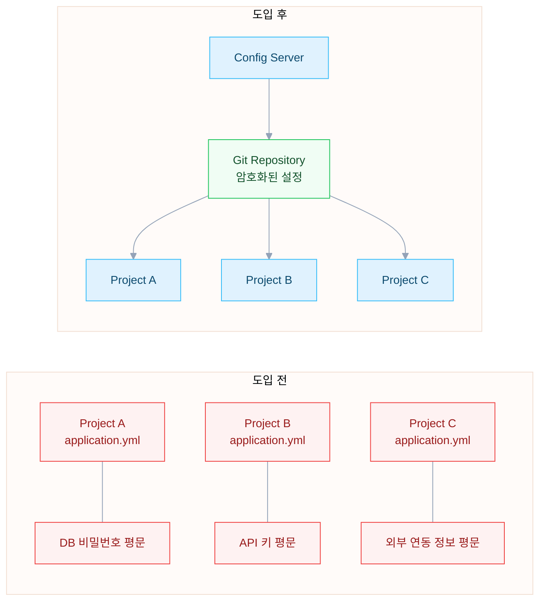

사내 여러 Java 프로젝트의 설정 파일 관리 방식이 문제라고 생각했다. 각 프로젝트가 `application.yml`에 DB 접속 정보와 API 키를 직접 들고 있었고 환경별로 프로파일을 나누더라도 민감한 값이 소스 코드 저장소에 그대로 노출되어 있었다. 설정값 하나를 바꾸려면 해당 프로젝트를 찾아가서 수정하고 다시 배포해야 했다.

보안 측면에서도 우려가 있었다. 설정 파일에 평문으로 들어 있는 DB 비밀번호나 외부 API 키가 저장소 권한만 있으면 누구나 볼 수 있었다. 퇴사자가 생기면 관련 credential을 전부 교체해야 하는데 어떤 프로젝트에 어떤 값이 들어 있는지 파악하는 것부터 일이었다.

Spring Cloud Config를 도입하면 설정 정보를 전용 Git 저장소에서 중앙 관리할 수 있고 `{cipher}` 기반 암호화도 지원한다. 여러 가지를 고려했을 때 도입하는 게 맞다고 판단했다.

---

## 도입 전후 비교



| 항목 | 도입 전 | 도입 후 |
|---|---|---|
| 설정 위치 | 각 프로젝트 application.yml | 전용 Git Repository |
| 민감 정보 | 평문 노출 | `{cipher}` 암호화 |
| 변경 이력 | 프로젝트별 Git 이력에 분산 | Config Repository에서 통합 추적 |
| 환경별 관리 | 프로파일 파일 복제 | 프로파일 + 라벨로 분기 |

---

## Config Server 구성

### Git SSH 연결

Config Server는 Git 저장소에서 설정 파일을 읽어온다. SSH 키를 등록하고 Spring Boot 설정에서 URI를 지정한다.

```yaml
spring:
  cloud:
    config:
      server:
        git:
          uri: git@config-host:myorg/cloud-config.git
```

SSH Config에서 Host를 별도로 지정하면 여러 Git 계정을 분리해서 관리할 수 있다.

```
Host config-host
    HostName github.com
    IdentityFile ~/credentials/config-ssh-key
    StrictHostKeyChecking no
```

### 프로젝트별 search-paths

여러 프로젝트가 하나의 Config Repository를 공유할 때는 `search-paths`로 디렉토리를 분리한다.

```yaml
spring:
  cloud:
    config:
      server:
        git:
          repos:
            project-alpha:
              uri: git@config-host:myorg/cloud-config.git
              pattern:
                - project-alpha-*/*
              search-paths:
                - '/project-alpha'
                - '/project-alpha/{application}'
                - '/project-alpha/{application}/{profile}'
```

`project-alpha-service`가 `stage` 프로파일로 요청하면 다음 순서로 설정 파일을 검색한다.

1. `/project-alpha/application.yml` (공통)
2. `/project-alpha/project-alpha-service/application.yml` (서비스 전용)
3. `/project-alpha/project-alpha-service/stage/application.yml` (환경 전용)

동일한 키가 여러 파일에 있으면 하위 경로가 우선한다. 환경 전용 > 서비스 전용 > 공통 순서다.

### 암호화 지원

Config Server는 `/encrypt`와 `/decrypt` 엔드포인트를 제공한다. 대칭 키 또는 비대칭 키를 설정하면 설정값을 암호화해서 Git에 저장할 수 있다.

```yaml
# Config Repository의 설정 파일
spring:
  datasource:
    password: '{cipher}AQBHxkX3...'
```

Client가 설정을 요청하면 Config Server가 자동으로 복호화해서 전달한다. Git 저장소에는 암호화된 값만 남기 때문에 저장소에 접근하더라도 평문 비밀번호를 볼 수 없다.

---

## Config Client 연동

### bootstrap.yml 설정

Client는 `bootstrap.yml`에서 Config Server 연결 정보를 정의한다. `application.yml`보다 먼저 로드되기 때문에 Config Server에서 받아온 설정이 애플리케이션 설정을 덮어쓴다.

```yaml
spring:
  application:
    name: front-service
  profiles:
    active: dev
  cloud:
    config:
      name: myproject-front-service
      uri: http://cloud-config-server.example.com/
      label: ${CONFIG_LABEL:master}
```

- `name`은 Config Server에서 설정 파일을 검색할 때 사용하는 애플리케이션 식별자다
- `label`은 Git 브랜치를 지정한다. 환경 변수로 주입하면 배포 버전별로 다른 설정을 적용할 수 있다

### 동적 갱신 (@RefreshScope)

기본적으로 Config Client는 애플리케이션 시작 시에만 설정을 가져온다. `@RefreshScope`와 Actuator `refresh` 엔드포인트를 조합하면 재시작 없이 설정을 갱신할 수 있다.

```java
@RefreshScope
@Configuration
public class ExternalApiConfig {
    @Value("${external.api.key}")
    private String apiKey;
}
```

```yaml
management:
  endpoints:
    web:
      exposure:
        include: health, refresh
```

```bash
# 설정 갱신 트리거
curl -X POST http://localhost:8080/actuator/refresh
```

갱신 대상은 `@RefreshScope`가 붙은 빈에 한정된다. 애플리케이션 전체에 `@RefreshScope`를 거는 것보다 설정값을 주입받는 Configuration 클래스에만 적용하는 게 낫다.

### 브랜치 기반 설정 선택

`label`에 여러 브랜치를 지정하면 폴백 순서를 정할 수 있다.

```yaml
spring:
  cloud:
    config:
      label: feature-branch, master
```

`feature-branch`에서 먼저 검색하고 없으면 `master`에서 가져온다. 설정 변경을 테스트할 때 유용하다.

---

## 테스트 환경 분리

통합 테스트에서 매번 Config Server에 접속하면 테스트가 느려진다. 테스트 환경에서는 Config Client를 비활성화하고 로컬 설정 파일을 사용한다.

```yaml
# test/resources/bootstrap.yml
spring:
  cloud:
    config:
      enabled: false
```

테스트에서 필요한 설정값은 `test/resources/application.yml`에 직접 정의한다. 외부 리소스에 의존하는 테스트는 학습 테스트로 분리하고 `@Disabled`로 기본 비활성화해두면 CI에서 불필요한 외부 호출을 막을 수 있다.

---

## 운영 시 주의할 점

1. **search-paths 변경 영향 범위**: 공통 Config Repository를 여러 프로젝트가 공유하면 search-paths 하나를 바꿨을 때 다른 프로젝트에 영향을 줄 수 있다. 변경 전에 관련 팀과 확인이 필요하다.
2. **Config Server 장애 대응**: Config Server가 내려가면 Client가 기동되지 않는다. `fail-fast: false`로 설정하면 Config Server 없이도 로컬 설정으로 기동할 수 있지만 설정 불일치 위험이 생긴다. 운영 환경에서는 Config Server의 가용성을 보장하는 게 우선이다.
3. **설정 파일 우선순위**: Config Server에서 받은 설정과 로컬 `application.yml`이 충돌할 수 있다. `bootstrap.yml` → Config Server → `application.yml` 순서로 로드되고 나중에 로드된 값이 이긴다는 점을 팀 전체가 알고 있어야 한다.

---

## 참고

- [Spring Cloud Config — Server](https://docs.spring.io/spring-cloud-config/reference/server.html)
- [Spring Cloud Config — Client](https://docs.spring.io/spring-cloud-config/reference/client.html)
