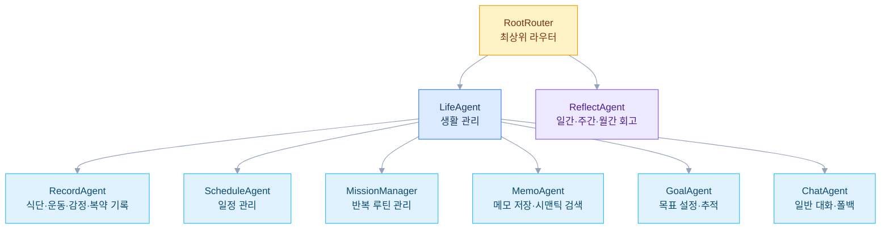

## 배경

매일 반복되는 건강 기록, 일정 확인, 회고 같은 루틴을 하나의 대화 인터페이스로 통합하고 싶었다. 기존 앱들은 기능별로 나뉘어 있어 "토스트 먹었어"라는 한마디로 식단 기록부터 칼로리 계산까지 처리하는 개인 비서를 직접 만들기로 했다. Google ADK를 활용해 역할별 에이전트를 나누고 대화 흐름을 설계했다.

*iOS 앱의 온보딩 흐름을 정리한 화면 시안*

## 에이전트 아키텍처

사용자 메시지가 들어오면 RootRouter가 생활 관리와 회고 중 어느 흐름인지 판단해 LifeAgent 또는 ReflectAgent로 전달한다. LifeAgent는 요청을 기록, 미션, 일정, 메모, 목표, 일반 대화, 폴백의 7개 범주로 분류하고 신뢰도에 따라 서브 에이전트를 선택한다. 대시보드 데이터는 별도 에이전트를 거치지 않고 Core REST API에서 제공한다.

사용자의 직접 입력뿐 아니라 앱 실행 시 미션 자동 실행, 시간대별 인사와 넛지, 리마인더 같은 시스템 트리거도 지원한다.

## 기술 스택 선택 이유

- **Google ADK 2.2 + Gemini 2.5 Flash**: 에이전트 간 계층적 라우팅과 세션 상태 관리를 활용해 역할별 흐름을 구성했다
- **Spring Boot 4.0 WebFlux + R2DBC**: 에이전트의 비동기 스트리밍 응답을 논블로킹 흐름으로 처리한다
- **PostgreSQL + pgvector**: 키워드가 정확히 일치하지 않아도 관련 메모를 찾도록 시맨틱 유사도 검색을 적용했다
- **Keycloak 듀얼 인증**: 모바일 앱 사용자 인증과 에이전트 간 인증을 서로 다른 흐름으로 분리했다

## 현재 진행 상황

핵심 에이전트와 건강 기록, 일정, 미션, 회고 흐름이 동작한다. SwiftUI iOS 앱에서 주요 화면과 Core API를 연결하고 있으며 넛지와 리마인더 같은 능동적 상호작용을 확장하고 있다.
