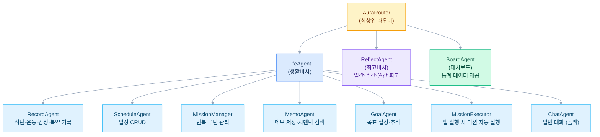

## 배경

매일 반복되는 건강 기록, 일정 확인, 회고 같은 루틴을 하나의 대화 인터페이스로 통합하고 싶었다. 기존 앱들은 기능별로 파편화돼 있어서 "토스트 먹었어"라는 한 마디로 식단 기록부터 칼로리 계산까지 처리하는 개인 비서를 직접 만들기로 했다. Google ADK의 멀티 에이전트 프레임워크를 활용해 역할별 에이전트를 분리하고 자연스러운 대화 흐름을 설계했다.

## 에이전트 아키텍처

사용자 메시지가 들어오면 AuraRouter가 assistant 유형(생활/회고)을 판단하고 LifeAgent 또는 ReflectAgent로 전달한다. LifeAgent는 LLM 기반 의도 분류기로 건강 기록·일정·미션·메모·목표 등 15종 인텐트를 식별하고 신뢰도 점수에 따라 적합한 서브 에이전트를 동적으로 선택한다.

사용자의 직접 입력뿐 아니라 앱 실행 시 미션 자동 실행, 시간대별 인사·넛지·리마인더 같은 시스템 트리거도 지원해 사용자와 능동적으로 상호작용한다.

## 기술 스택 선택 이유

- **Google ADK + Gemini 2.0 Flash**: 에이전트 간 계층적 라우팅과 세션 상태 관리가 프레임워크 수준에서 지원돼 직접 구현할 오케스트레이션 코드를 줄였다
- **Spring Boot 4.0 WebFlux + R2DBC**: 에이전트의 비동기 스트리밍 응답을 논블로킹으로 처리하기 위해 리액티브 스택 선택
- **PostgreSQL + pgvector**: 메모 검색에 시맨틱 유사도 검색을 적용해 키워드가 정확히 일치하지 않아도 관련 메모를 찾을 수 있게 했다
- **Keycloak 듀얼 인증**: 모바일 앱 사용자와 에이전트 시스템의 인증을 분리해 보안과 편의성을 모두 확보했다

## 현재 진행 상황

MVP 단계로 핵심 에이전트(Router · LifeAgent · ReflectAgent)와 건강 기록·일정 관리 기능이 동작하는 상태다. iOS 앱 프론트엔드를 Swift로 개발 중이며 넛지·리마인더 같은 능동적 상호작용 기능을 확장하고 있다.
