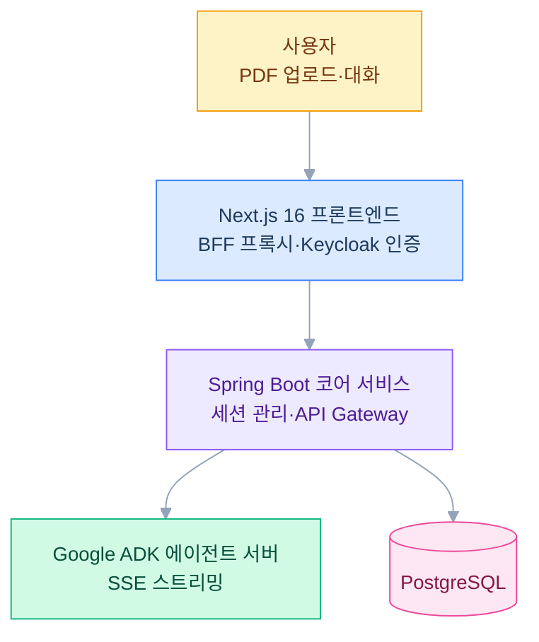
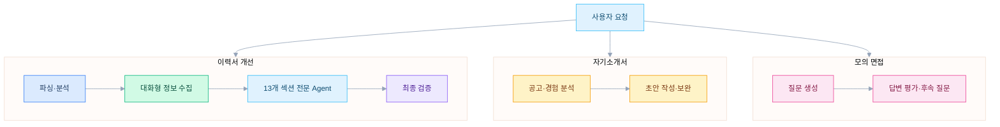

## 배경

프로그래머스에서 탑프로그래머스로 선정된 뒤 담당 매니저와 대화하며 취업 준비에 많은 도움을 받았다. 혼자 이력서와 공고를 볼 때는 잘 보이지 않던 부분도 누군가 질문하고 경험을 함께 정리해 주면 훨씬 분명해진다는 걸 그때 느꼈다.

AI를 접한 뒤에는 당시 받았던 도움을 AI Agent로도 제공할 수 있지 않을까 생각했다. 이력서를 쓸 때마다 경력을 정리하고 성과를 구체화하며 기술 스택을 맞추는 작업도 반복됐다. 그래서 PDF 이력서를 올리면 부족한 내용을 질문하고, 이력서 개선부터 자기소개서 작성과 면접 준비까지 대화로 이어서 돕는 도구를 만들었다.

*이력서 분석 결과와 대화 영역의 관계를 정리한 화면 시안*

## 시스템 구성

Next.js BFF가 Keycloak JWT 토큰을 주입해 Spring Boot 코어로 전달한다. 코어 서비스는 세션과 영속성을 관리하면서 ADK 에이전트 서버에 요청하고, 진행 상황과 응답을 SSE로 클라이언트에 전달한다.

## 에이전트 워크플로

에이전트 서버에는 이력서 개선, 자기소개서, 모의 면접을 위한 세 개의 ADK 2.0 그래프 워크플로가 있다. 이력서 개선은 PDF 파싱과 분석, 대화형 정보 수집, 13개 섹션별 개선, 최종 검증 순서로 진행된다. 자기소개서와 모의 면접은 각각 채용 공고와 사용자 경험을 바탕으로 필요한 단계를 이어간다.

## 기술적 결정

- **Spring Boot 코어 + ADK 에이전트 분리**: 세션 관리, 인증, 영속성은 Kotlin/Spring Boot가 담당하고 AI 처리는 Python/ADK 서버가 담당한다
- **ADK 2.0 그래프 워크플로**: 작업별 상태와 다음 단계를 그래프로 표현하고 사용자 확인이 필요한 지점에서 흐름을 이어간다
- **SSE 스트리밍**: 시간이 걸리는 분석 과정과 진행 상황을 클라이언트에 전달한다
- **BFF 프록시 패턴**: Next.js BFF가 인증 토큰을 주입해 코어 서비스로 요청을 전달한다
- **Hexagonal Architecture**: 도메인 로직과 인프라 연동 코드를 분리해 각 서비스의 경계를 명확히 했다

## 현재 진행 상황

이력서 개선, 자기소개서, 모의 면접 에이전트를 ADK 2.0 그래프 워크플로로 구현했다. 현재 Spring Boot 코어와 Next.js 클라이언트의 연동 흐름을 다듬고 있다.
