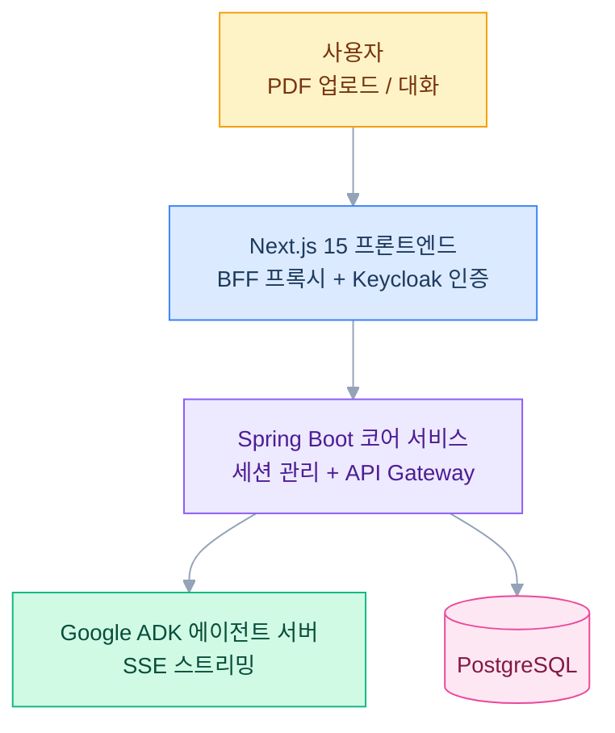

## 배경

이력서를 쓸 때마다 같은 패턴이 반복됐다. 경력 사항을 나열하고 성과를 수치화하고 기술 스택을 정리하는 작업은 본질적으로 구조화된 데이터 추출 문제다. PDF 이력서를 올리면 구조를 파싱하고 부족한 부분을 분석한 뒤 인터뷰를 통해 추가 정보를 수집하고 섹션별로 개선해주는 도구를 만들고 싶었다.

## 시스템 구성

프론트엔드의 BFF(Backend For Frontend) 프록시가 Keycloak JWT 토큰을 주입하고 Spring Boot 코어로 전달한다. 코어 서비스는 세션을 관리하면서 ADK 에이전트 서버에 SSE 스트리밍 요청을 보내고 응답을 그대로 클라이언트에 전달한다.

## 에이전트 아키텍처

```mermaid
---
config:
  theme: base
  themeVariables:
    primaryColor: "#e0f2fe"
    primaryTextColor: "#0c4a6e"
    primaryBorderColor: "#38bdf8"
    lineColor: "#94a3b8"
    fontSize: "14px"
---
flowchart LR
    subgraph 분석["1단계: 분석"]
        Parser["이력서 파싱"]
        Analyzer["내용 분석"]
        Checker["누락 항목 식별"]
    end

    subgraph 수집["2단계: 정보 수집"]
        Intent["사용자 목적 파악"]
        QGen["질문 생성"]
        QInt["대화형 인터뷰"]
    end

    subgraph 개선["3단계: 개선"]
        Sections["13개 섹션 전문 Agent"]
        Validator["최종 검증"]
    end

    분석 --> 수집 --> 개선

    style Parser fill:#dbeafe,stroke:#3b82f6,color:#1e3a5f
    style Analyzer fill:#dbeafe,stroke:#3b82f6,color:#1e3a5f
    style Checker fill:#dbeafe,stroke:#3b82f6,color:#1e3a5f
    style Intent fill:#d1fae5,stroke:#10b981,color:#064e3b
    style QGen fill:#d1fae5,stroke:#10b981,color:#064e3b
    style QInt fill:#d1fae5,stroke:#10b981,color:#064e3b
    style Sections fill:#e0f2fe,stroke:#38bdf8,color:#0c4a6e
    style Validator fill:#ede9fe,stroke:#8b5cf6,color:#4c1d95
```

오케스트레이터가 3단계 워크플로우를 조율한다. 이력서 PDF가 들어오면 파싱 → 분석 → 누락 항목 체크를 거치고 사용자와 대화형 인터뷰로 부족한 정보를 수집한 뒤 13개 섹션 전문 에이전트가 각 영역을 개선한다. Validator가 최종 품질을 검증한다.

## 기술적 결정

- **Spring Boot 코어 + ADK 에이전트 분리**: 세션 관리·인증·영속성은 Kotlin/Spring Boot가 담당하고 AI 처리는 Python/ADK 서버가 담당하도록 역할을 분리했다
- **SSE 스트리밍**: 이력서 분석은 시간이 걸리는 작업이라 SSE로 실시간 진행 상황을 클라이언트에 전달한다
- **BFF 프록시 패턴**: 프론트엔드에서 직접 백엔드를 호출하지 않고 Next.js BFF가 인증 토큰을 주입해 보안을 확보했다
- **Hexagonal Architecture**: 도메인 로직을 인프라에서 분리해 에이전트 서버나 DB 변경에 유연하게 대응할 수 있게 설계했다

## 현재 진행 상황

이력서 파싱과 분석 에이전트 파이프라인이 동작하는 상태다. 자기소개서 자동 생성, 모의 면접 기능을 순차적으로 구현할 예정이다.
